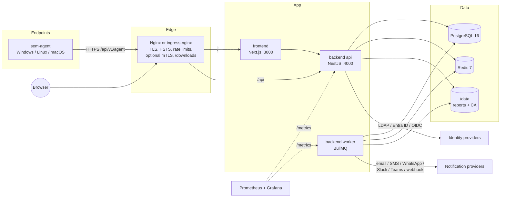

# SecureEndpoint Manager

SecureEndpoint Manager is an enterprise platform for device and software compliance, in the same space as Microsoft Intune and NinjaOne. It enrolls Windows, Linux and macOS endpoints with a lightweight Go agent and enforces company security policy on them: USB storage control, approved software only, antivirus/EDR, disk encryption, firewall, patching and screen lock. Every device gets a compliance score and a risk level, alerts go out on email, SMS, WhatsApp, Slack, Teams or webhooks, and every action lands in a tamper-evident audit trail.

| | |
|---|---|
| **Backend** | NestJS 11, Prisma 6, PostgreSQL 16, Redis 7 and BullMQ (`backend/`) |
| **Console** | Next.js, React 19, TanStack Query (`frontend/`) |
| **Agent** | Go 1.23, one static binary per OS and arch (`agent/`) |
| **Delivery** | Docker Compose, Kubernetes (Kustomize), GitHub Actions, Prometheus and Grafana |

---

## Contents

- [Features](#features)
- [Architecture](#architecture)
- [Quick start](#quick-start)
- [Demo accounts](#demo-accounts)
- [Repository layout](#repository-layout)
- [Development](#development)
- [Documentation](#documentation)
- [Security](#security)
- [License](#license)

---

## Features

### Core policy requirements

| # | Requirement | Policy setting (`DevicePolicy`) | Enforcement (agent) | Detection (compliance rule) | Management (API / console) |
|---|---|---|---|---|---|
| 1 | Company data only on company-managed devices | `companyDataOnlyManaged` | Enrollment required; `isCompanyOwned` flag | `NOT_COMPANY_DEVICE` (CRITICAL) | `/devices`, `/enrollment`, device quarantine |
| 2 | USB mass storage blocked, with whitelisting and temporary access | `usbStorageBlocked`, `allowWhitelistedUsb`, `usbReadOnly` | Blocks storage-class devices, reports `BLOCKED`/`ALLOWED`/file events, applies whitelist with expiry | `USB_STORAGE_ENABLED` (HIGH) | `/usb/devices`, `/usb/events`, `/usb/requests` (approve, deny, revoke) |
| 3 | Only approved software | `blockUnauthorizedSoftware`, `autoUninstallBlacklisted` | Inventory, software events, `UNINSTALL_SOFTWARE` command | `UNAUTHORIZED_SOFTWARE` (HIGH) | `/software/whitelist`, `/software/blacklist`, `/software/unauthorized`, `/software/uninstall`, `/software/licenses` |
| 4 | Antivirus and EDR mandatory | `requireAntivirus`, `requireEdr`, `maxAvSignatureAgeDays` | Reports AV/EDR state and signature age | `ANTIVIRUS_MISSING` (CRITICAL), `ANTIVIRUS_OUTDATED`, `EDR_MISSING` (HIGH) | `/security/overview`, `/security/devices` |
| 5 | Full-disk encryption | `requireDiskEncryption` | BitLocker, FileVault and LUKS detection; `ENABLE_ENCRYPTION` command | `DISK_ENCRYPTION_DISABLED` (CRITICAL) | `/security/*`, device commands |
| 6 | Host firewall enabled | `requireFirewall` | Reports firewall state | `FIREWALL_DISABLED` (HIGH) | `/security/*` |
| 7 | Automatic updates and timely patching | `autoUpdateEnabled`, `autoPatchDeployment`, `patchDeadlineDays`, `maintenanceWindow` | Reports patches and CVEs; `INSTALL_PATCHES` command | `AUTO_UPDATE_DISABLED`, `CRITICAL_PATCHES_MISSING` (HIGH) | `/patches`, `/patches/vulnerabilities`, `/patches/deploy` |
| 8 | Screen lock and password on wake | `screenLockEnabled`, `screenLockTimeoutSec`, `requirePasswordOnWake`, `screenSaverEnforced` | Enforces and reports lock settings; `LOCK_SCREEN` command | `SCREEN_LOCK_DISABLED` (MEDIUM) | policy editor |
| 9 | Continuous monitoring, alerting and audit | `checkinIntervalSec`, `inventoryIntervalSec` | Heartbeat and state reports | `AGENT_OFFLINE`, `SECURE_BOOT_DISABLED` | `/alerts`, `/audit` (hash chain, `/audit/verify`), `/reports`, Prometheus alerts |

The rule conditions, weights and scoring are in [docs/COMPLIANCE-ENGINE.md](docs/COMPLIANCE-ENGINE.md).

### Modules

| # | Module | What it does | Backend (`/api/v1`) | Agent |
|---|---|---|---|---|
| 1 | **Dashboard** | Fleet KPIs, compliance trend, top violations, department compliance, recent alerts | `/dashboard/*` | – |
| 2 | **Device inventory & assets** | Hardware and OS inventory, assignment history, warranty, tags, quarantine, remote commands | `/devices` | hardware collector, command runner |
| 3 | **Enrollment & agent management** | Scoped enrollment tokens, install one-liners, approval queue, device certificates from an internal CA | `/enrollment`, `/agent/enroll` | installer, CSR/keypair, service |
| 4 | **Policy management** | Versioned policies; resolution order device → department → default; push via `APPLY_POLICY` | `/policies` | policy enforcer |
| 5 | **Compliance engine** | 13 built-in weighted rules, score 0–100, state and risk level, re-evaluation queue | `/compliance` | – (server side) |
| 6 | **Software management** | Inventory, whitelist and blacklist (exact, contains, regex), license compliance, remote uninstall | `/software` | software inventory, uninstaller |
| 7 | **USB device control** | Block storage, device whitelist (global, department, user, device), temporary access workflow, event log | `/usb` | USB monitor and blocker |
| 8 | **Endpoint security posture** | AV, EDR, firewall, encryption, secure boot, TPM, screen lock | `/security` | posture collectors |
| 9 | **Patch & vulnerability management** | Missing patches by severity, CVE and CVSS view, patch deployment | `/patches` | update agent |
| 10 | **Alerts & notifications** | Deduplicated alerts, acknowledge and resolve, channels: email, SMS, WhatsApp, Slack, Teams, HMAC-signed webhook | `/alerts` | – |
| 11 | **Audit trail** | Append-only, SHA-256 hash-chained audit log, login history, verification, CSV export | `/audit` | – |
| 12 | **Reports & scheduling** | Compliance, device, software, security, audit, USB and patch reports in PDF, XLSX or CSV; cron schedules with email delivery | `/reports` | – |
| – | **Identity & access** (cross-cutting) | Local, LDAP/AD, Entra ID and OIDC login; TOTP MFA; 7 roles with a permission matrix and row scoping; sessions; IP restrictions | `/auth`, `/users`, `/roles`, `/departments`, `/settings` | – |

The complete API contract is in [docs/API.md](docs/API.md).

---

## Architecture



Agents send heartbeats and full state reports. The api stores inventory and posture, classifies software and evaluates compliance. Bulk evaluations, alert delivery, report generation and maintenance run on the worker through BullMQ. See [docs/ARCHITECTURE.md](docs/ARCHITECTURE.md) for sequence diagrams (enrollment, check-in, evaluation, USB approval, reports), the module map and the data model.

---

## Quick start

You need Docker with Compose v2, plus `bash` and `openssl`. On Windows, use Git Bash or WSL, or the PowerShell secrets script.

```bash
git clone https://github.com/<org>/secureendpoint-manager.git && cd secureendpoint-manager
./scripts/generate-secrets.sh           # Windows: .\scripts\generate-secrets.ps1
./scripts/gen-self-signed-cert.sh       # local TLS certificate for https://localhost
docker compose up -d --build            # first build takes a few minutes
docker compose ps                       # wait until backend, frontend and nginx are healthy
```

Open **https://localhost** and accept the self-signed certificate warning. Log in with:

| | |
|---|---|
| Email | `admin@secureendpoint.local` |
| Password | `ChangeMe!Secure2026` |

Useful extras:

```bash
docker compose --profile monitoring up -d                          # Prometheus, Alertmanager, Grafana (http://127.0.0.1:3001)
docker compose -f docker-compose.yml -f docker-compose.dev.yml up -d  # + Mailpit (http://127.0.0.1:8025), DB/Redis on localhost
docker compose -f docker-compose.yml -f docker-compose.dev.yml --profile ldap up -d   # + OpenLDAP with sample users
make help                                                          # all shortcuts
```

API docs (Swagger UI) are at **https://localhost/api/docs**. Agent binaries and install scripts are at **https://localhost/downloads/**.

> The quick start is for evaluation only. For production, follow [docs/DEPLOYMENT.md](docs/DEPLOYMENT.md): real certificates, `SEED_DEMO_DATA=false`, a strong admin password, MFA, backups of `ENCRYPTION_KEY` and `/data/pki`.

---

## Demo accounts

When `SEED_DEMO_DATA=true` (the default in `.env.example`), the seed creates demo departments, policies and devices, plus one user per role. **All of them use the password `ChangeMe!Secure2026`.**

| Email | Role | Typical use |
|---|---|---|
| `admin@secureendpoint.local` | Super Admin | Everything, including roles and settings |
| `secadmin@secureendpoint.local` | Security Admin | Policies, rules, alert channels, security settings |
| `compliance@secureendpoint.local` | Compliance Officer | Compliance results, rules, reports, audit |
| `itadmin@secureendpoint.local` | IT Admin | Devices, enrollment, software, USB, patches, users |
| `manager@secureendpoint.local` | Department Manager | Own department's devices; approve USB requests |
| `employee@secureendpoint.local` | Employee | Own devices; request USB access |
| `auditor@secureendpoint.local` | Auditor | Read-only access including the audit trail |

MFA enrolment is enforced for Super Admin and Security Admin (`SECURITY_MFA_REQUIRED_ROLES`), so have an authenticator app ready. The full permission matrix is in [docs/API.md](docs/API.md#roles--permissions), and per-role walkthroughs are in [docs/USER-GUIDE.md](docs/USER-GUIDE.md).

---

## Repository layout

```
.
├── backend/                  NestJS API + worker, Prisma schema & migrations      (backend team)
├── frontend/                 Next.js admin console                                 (frontend team)
├── agent/                    Go endpoint agent, install scripts, agent-dist image  (agent team)
├── deploy/
│   ├── nginx/                nginx.conf, conf.d/secureendpoint.conf, snippets/, certs/README.md
│   ├── prometheus/           prometheus.yml, alerts.yml, alertmanager.yml
│   ├── grafana/              provisioning/ + dashboards/ (Compliance Overview, Platform Health)
│   ├── k8s/                  Kustomize base, overlays (staging, production), optional postgres/redis
│   └── dev/ldap/             OpenLDAP sample directory for development
├── docs/                     API, architecture, deployment, security, runbook, user guide…
├── scripts/                  generate-secrets.{sh,ps1}, gen-self-signed-cert.sh, validate-infra.sh, …
├── .github/                  CI, CodeQL, release, deploy workflows; Dependabot; CODEOWNERS; PR template
├── docker-compose.yml        production-like stack (profiles: monitoring, node-exporter)
├── docker-compose.dev.yml    development override (exposed ports, Mailpit, OpenLDAP)
├── .env.example              every configuration variable, documented
└── Makefile                  up, down, dev, logs, build, test, seed, secrets, k8s-render, agent-dist, …
```

---

## Development

| Task | Command |
|---|---|
| Start the dev stack (DB and Redis on localhost, Mailpit, OpenLDAP) | `make dev` |
| Backend hot reload against the dev DB | `cd backend && npm ci && npx prisma migrate dev && npm run start:dev` (with `DATABASE_URL=postgresql://sem:<POSTGRES_PASSWORD>@localhost:5432/secureendpoint`) |
| Frontend hot reload | `cd frontend && npm ci && API_INTERNAL_URL=http://localhost:4000 npm run dev` |
| Agent build and test | `cd agent && go test ./... && go build ./...` |
| Run all tests and linters | `make test` |
| Validate compose, nginx, Prometheus, k8s and workflows | `./scripts/validate-infra.sh` |
| Render Kubernetes manifests | `make k8s-render OVERLAY=staging` |

CI (`.github/workflows/ci.yml`) runs the lint, unit, e2e and build jobs for all three components, a multi-OS Go test matrix with cross-compilation, Docker builds, infrastructure validation, Trivy, npm audit, govulncheck and gosec. CodeQL runs separately. Tags `v*` trigger `release.yml`: multi-arch GHCR images with SBOM and provenance, cosign keyless signatures, a Trivy CRITICAL gate, and a GitHub Release with the agent binaries. `deploy.yml` deploys a signed tag to staging or production, with approvals and automatic rollback.

---

## Documentation

| Document | Contents |
|---|---|
| [docs/API.md](docs/API.md) | REST API contract, RBAC matrix, agent protocol |
| [docs/ARCHITECTURE.md](docs/ARCHITECTURE.md) | Components, data flow, sequence diagrams, module map, ER model, scaling |
| [docs/DEPLOYMENT.md](docs/DEPLOYMENT.md) | Production deployment guide: sizing, TLS, Compose, Kubernetes, SSO, alert channels, agent rollout, backups, upgrades, monitoring |
| [docs/SECURITY.md](docs/SECURITY.md) | Security architecture, controls, threat model, compliance mapping, vulnerability disclosure |
| [docs/ENVIRONMENT.md](docs/ENVIRONMENT.md) | Every environment variable |
| [docs/COMPLIANCE-ENGINE.md](docs/COMPLIANCE-ENGINE.md) | Rules, scoring, states, risk, alerting, tuning |
| [docs/RUNBOOK.md](docs/RUNBOOK.md) | Operational procedures and incident response |
| [docs/USER-GUIDE.md](docs/USER-GUIDE.md) | Per-role guide and walkthroughs |
| [deploy/k8s/README.md](deploy/k8s/README.md) | Kustomize layout and image expectations |
| [deploy/nginx/certs/README.md](deploy/nginx/certs/README.md) | TLS certificates and Let's Encrypt |

---

## Security

Report vulnerabilities privately as described in [docs/SECURITY.md](docs/SECURITY.md#vulnerability-disclosure-policy). Do not open public issues for them.

## License

Proprietary. See [LICENSE](LICENSE).
