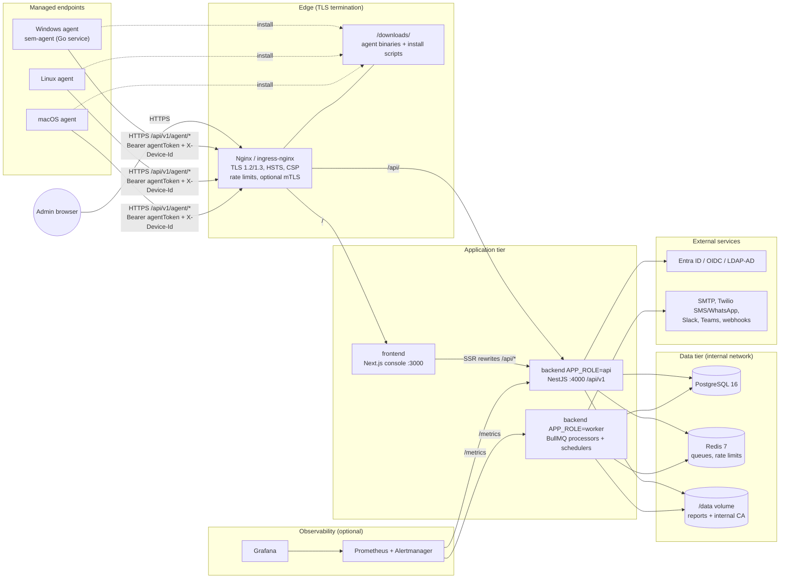
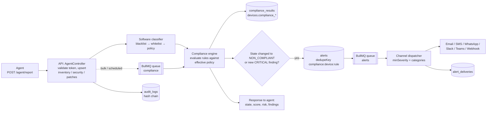
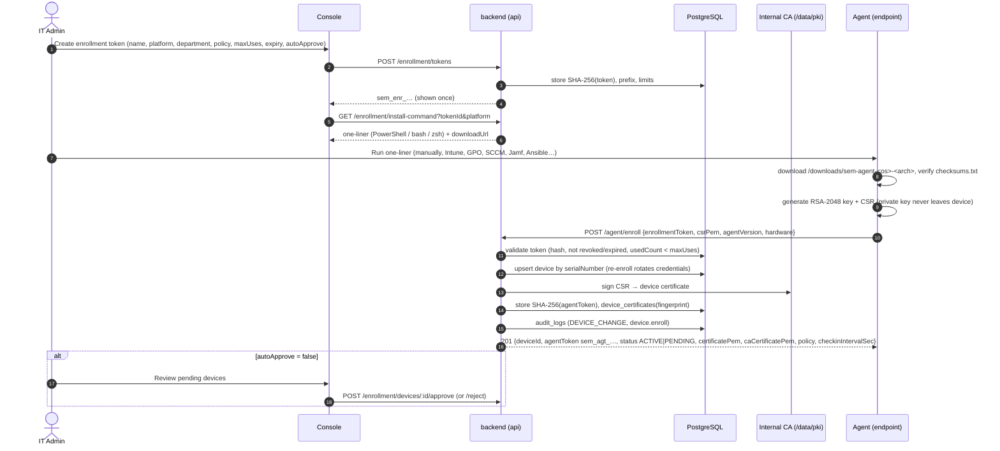
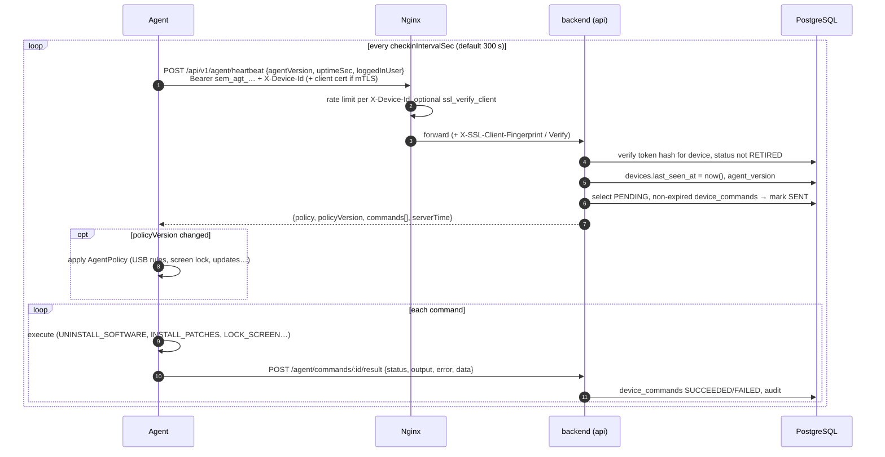
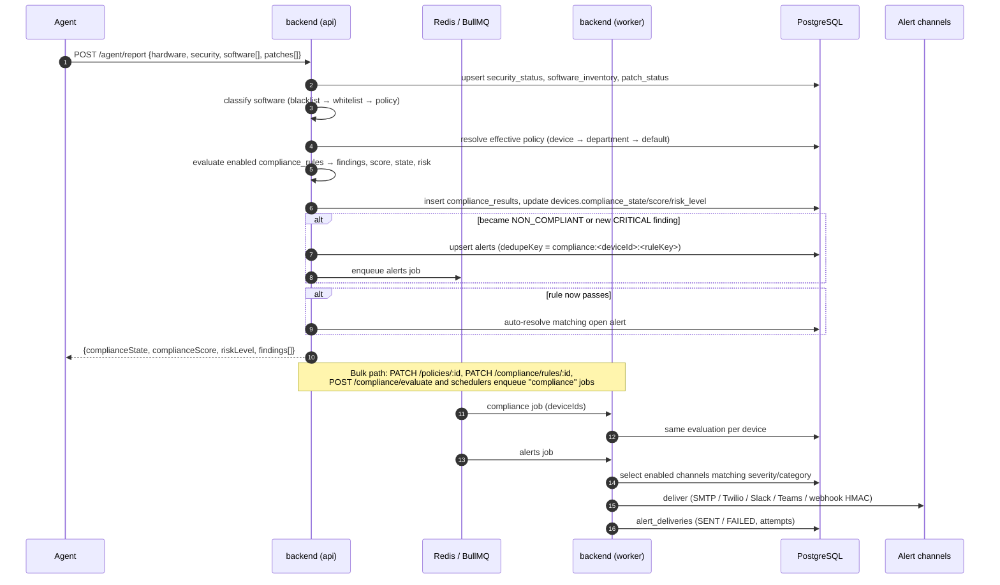
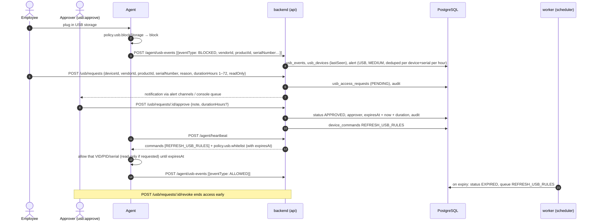
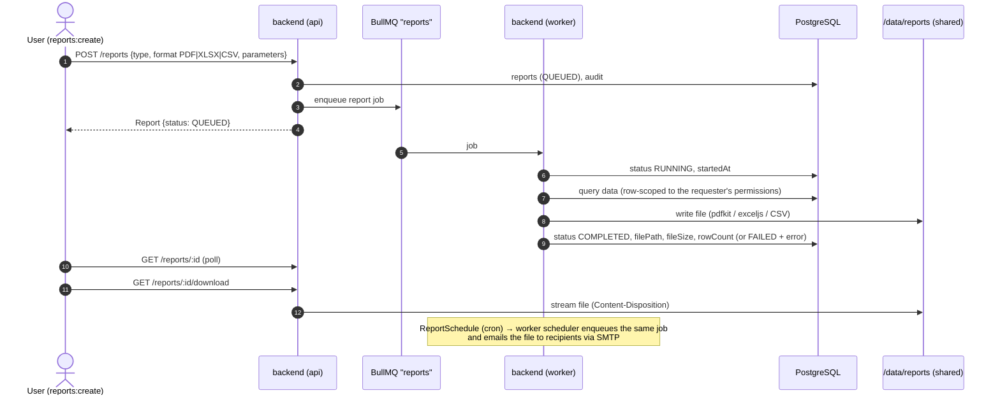
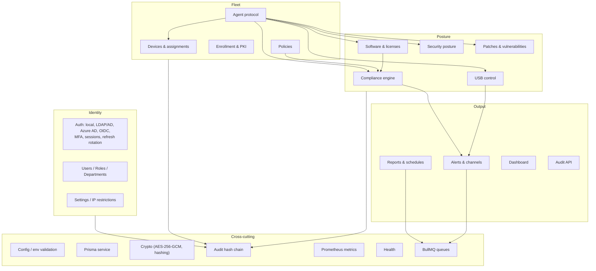
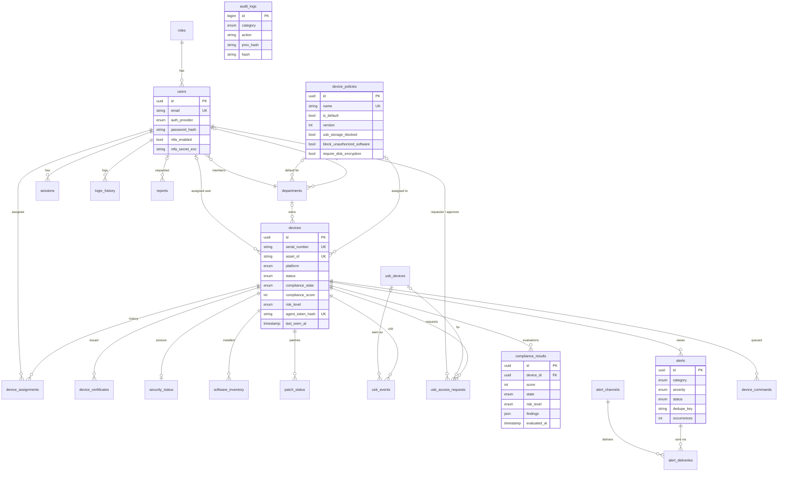

# Architecture

SecureEndpoint Manager is a single-tenant platform for device and software compliance. The endpoint agents collect state, the backend enforces policy, and the web console lets operators administer the fleet. This document describes the components, how data moves between them, the main interaction sequences, the data model and the scaling model.

- API contract: [API.md](API.md)
- Security controls: [SECURITY.md](SECURITY.md)
- Compliance rules and scoring: [COMPLIANCE-ENGINE.md](COMPLIANCE-ENGINE.md)
- Deployment: [DEPLOYMENT.md](DEPLOYMENT.md)

---

## 1. Components

| Component | Technology | Responsibilities | Scales |
|---|---|---|---|
| **Agent** | Go 1.23, one static binary per OS/arch, runs as a system service | Enrollment with a CSR, heartbeat, full state reports (hardware, security posture, software, patches), USB and software event streaming, local enforcement (USB blocking, uninstall, patching, screen lock), command execution | One per endpoint |
| **Nginx / Ingress** | nginx 1.27 or ingress-nginx | TLS, HTTP to HTTPS redirect, security headers, per-zone rate limits, optional agent mTLS, static `/downloads/`, blocking `/metrics` from outside | Horizontally |
| **frontend** | Next.js (standalone), React 19, TanStack Query | Admin console. The browser calls the relative path `/api/v1`, and Next rewrites `/api/*` to `http://backend:4000` for server-side calls | Stateless, HPA |
| **backend (api)** | NestJS 11, Prisma 6, argon2, JWT, prom-client | REST API, authentication (local, LDAP, SSO, MFA), RBAC and row scoping, agent protocol, audit hash chain, enqueuing work | Stateless, HPA (at least 3) |
| **backend (worker)** | Same image, `APP_ROLE=worker`, BullMQ | Queue processors for `compliance`, `reports`, `alerts` and `maintenance`. Schedulers for periodic re-evaluation, scheduled reports, USB access expiry, command expiry and data retention | HPA on CPU and memory, at least 2 |
| **PostgreSQL** | 16 | System of record (see §6) | Vertical, plus read replicas or managed HA |
| **Redis** | 7, AOF, `noeviction` | BullMQ queues, distributed rate-limit counters, short-lived caches | Vertical, or a managed service |
| **/data volume** | Docker volume `app-data`, or RWX PVC `sem-data` | `/data/reports` (report files the worker writes and the api streams) and `/data/pki` (internal device CA) | Shared (RWX) |
| **agent-dist** | One-shot image | Copies `sem-agent-*`, `install.ps1`, `install.sh`, `install-macos.sh` and `checksums.txt` into the `downloads` volume or `emptyDir` | Runs at deploy time |

The api and the worker are the **same image** with different `APP_ROLE` values. Both expose `/api/v1/health`, `/api/v1/health/ready` and `/metrics` on port 4000, so the same probes and scrape configs work for both.

---

## 2. Data flow

The main pipeline runs from agent telemetry to a compliance decision to notifications:

1. **Collection.** The agent sends `POST /agent/heartbeat` every `checkinIntervalSec` (default 300 s) and `POST /agent/report` every `inventoryIntervalSec` (default 3600 s) or whenever local state changes. USB and software events are streamed as they happen.
2. **Ingestion.** The api authenticates the agent (SHA-256 of the bearer token must match `devices.agent_token_hash` for `X-Device-Id`). It upserts `security_status`, `software_inventory` and `patch_status`, marks software that was not reported as removed, and writes audit entries for installs and removals.
3. **Classification.** Each software item is classified as `APPROVED`, `UNAUTHORIZED`, `BLACKLISTED` or `UNKNOWN` (see [COMPLIANCE-ENGINE.md](COMPLIANCE-ENGINE.md)).
4. **Evaluation.** Reports are evaluated inline so the agent receives its current state in the response. Bulk re-evaluations (policy change, rule change, `POST /compliance/evaluate`, schedulers) go through the `compliance` queue on the workers.
5. **Alerting.** Transitions to `NON_COMPLIANT` or new CRITICAL findings raise deduplicated alerts. Blocked USB events raise USB alerts. The `alerts` queue fans each alert out to every enabled channel whose `minSeverity` and `categories` match, and records every attempt in `alert_deliveries`.
6. **Enforcement.** The policy itself goes to the agent (`AgentPolicy`, versioned). Remediation goes as commands (`UNINSTALL_SOFTWARE`, `INSTALL_PATCHES`, `APPLY_POLICY`, `REFRESH_USB_RULES`, `LOCK_SCREEN`, …) that the agent picks up on its next heartbeat.

---

## 3. Key sequences

### 3.1 Enrollment

### 3.2 Check-in (heartbeat) and command delivery

### 3.3 Compliance evaluation

### 3.4 USB temporary access approval

### 3.5 Report generation

---

## 4. Module map

The backend is a modular NestJS application. Each business module owns its controllers, services, DTOs and Prisma access. Cross-cutting concerns are global providers.

| # | Module | API prefix | Main tables | Queue |
|---|---|---|---|---|
| 1 | Dashboard | `/dashboard` | (aggregates) | – |
| 2 | Device inventory & assets | `/devices` | `devices`, `device_assignments`, `device_commands` | – |
| 3 | Enrollment & agent management | `/enrollment`, `/agent` | `enrollment_tokens`, `device_certificates` | – |
| 4 | Policy management | `/policies` | `device_policies` | compliance |
| 5 | Compliance engine | `/compliance` | `compliance_rules`, `compliance_results` | compliance |
| 6 | Software management | `/software` | `software_inventory`, `software_whitelist`, `software_blacklist` | compliance |
| 7 | USB device control | `/usb` | `usb_devices`, `usb_events`, `usb_access_requests` | maintenance (expiry) |
| 8 | Endpoint security posture | `/security` | `security_status` | – |
| 9 | Patch & vulnerability management | `/patches` | `patch_status` | – |
| 10 | Alerts & notifications | `/alerts` | `alerts`, `alert_channels`, `alert_deliveries` | alerts |
| 11 | Audit trail | `/audit` | `audit_logs`, `login_history` | – |
| 12 | Reports & scheduling | `/reports` | `reports`, `report_schedules` | reports |
| – | Identity & access | `/auth`, `/users`, `/roles`, `/departments`, `/settings` | `users`, `roles`, `sessions`, `departments`, `ip_restrictions`, `system_settings` | maintenance (cleanup) |

---

## 5. Request pipeline (api)

Every HTTP request passes through the same chain:

1. **Nginx.** TLS, rate limit zone (`sem_api`, `sem_auth`, `sem_agent`, `sem_enroll`), and an `X-Request-Id` header (created or propagated).
2. **Express and helmet.** Security headers and `trust proxy`, so the real client IP comes from `X-Forwarded-For`.
3. **Request logging** with pino, including the request ID. The HTTP metrics middleware records `sem_http_requests_total` and `sem_http_request_duration_seconds`.
4. **Throttler.** `RATE_LIMIT_*` limits, and `AUTH_RATE_LIMIT_MAX` for `/auth`. Counters must use shared (Redis) storage when the api runs more than one replica; otherwise each replica counts separately.
5. **IP restriction guard.** Applies to console routes only. Agent endpoints are exempt.
6. **Authentication guard.** Console routes take a JWT. Agent routes take the agent token plus `X-Device-Id`.
7. **Permission guard.** Checks the `resource:action` permissions from the role, then applies row scoping for DEPARTMENT_MANAGER and EMPLOYEE.
8. **Validation pipe.** class-validator on the DTOs, with whitelisting.
9. **Controller → service → Prisma.** State-changing actions write an `audit_logs` entry.
10. **Exception filter.** Produces the uniform error envelope `{statusCode, error, message, path, timestamp, requestId}`.

---

## 6. Data model

The PostgreSQL schema is defined in [`backend/prisma/schema.prisma`](../backend/prisma/schema.prisma). Tables are snake_case plurals and every primary key is a UUID, except `audit_logs`, which uses a `bigserial` so the hash chain has a stable order.

Other tables: `enrollment_tokens`, `compliance_rules`, `software_whitelist`, `software_blacklist`, `ip_restrictions`, `report_schedules` and `system_settings`.

**Data sensitivity**

| Class | Where | Protection |
|---|---|---|
| Credentials | `users.password_hash` (argon2id), `sessions.refresh_token_hash`, `devices.agent_token_hash`, `enrollment_tokens.token_hash` (SHA-256), `users.mfa_recovery_hashes` | Only hashes are stored |
| Secrets | `users.mfa_secret_enc`, `alert_channels.config_enc`, `software_whitelist.license_key_enc` | AES-256-GCM with `ENCRYPTION_KEY` |
| Personal data | users (email, phone), device assignment, logged-in user names, USB file paths | RBAC, row scoping, audit trail |
| Evidence | `audit_logs` (append-only hash chain), `login_history` | Tamper evidence via `GET /audit/verify` |

---

## 7. Scaling model

| Tier | Strategy | Notes |
|---|---|---|
| Agents | Jittered intervals (heartbeat 300 s, inventory 3600 s by default, tunable per policy) | 10 000 devices at 300 s is about 33 heartbeats/s plus about 3 reports/s |
| Nginx / Ingress | Horizontal | Keep-alive to upstreams. Agent rate limits are keyed per device, not per IP, because of NAT |
| api | Stateless and horizontal (HPA on CPU and memory, 3 to 20 replicas) | JWTs are verified locally. Sessions live in PostgreSQL. Shared state lives in PostgreSQL or Redis |
| worker | Horizontal. BullMQ distributes jobs, one job per worker slot | Scale on the `sem_queue_jobs{state="waiting"}` backlog (alert `SemQueueBacklog`). Each scheduled task must run once per interval no matter how many workers exist. BullMQ repeatable jobs (or a Redis lock) provide this |
| PostgreSQL | Vertical first, then managed HA with read replicas | The largest tables are `software_inventory`, `usb_events`, `audit_logs` and `compliance_results`. Plan retention (see [DEPLOYMENT.md](DEPLOYMENT.md#sizing)) |
| Redis | Vertical, or a managed service | Small dataset. `noeviction` is mandatory for BullMQ |
| /data | RWX shared file system | Report files are small to medium. Object storage (S3-compatible) is planned as future work |

For hardware sizing per fleet size, see [DEPLOYMENT.md, Sizing](DEPLOYMENT.md#sizing).

---

## 8. Multi-tenancy

SecureEndpoint Manager is **single-tenant by design**. One deployment serves one organisation, with one PostgreSQL database, one internal CA and one `ENCRYPTION_KEY`. Isolation *inside* an organisation comes from RBAC and row scoping: department managers see only their departments, and employees see only their own devices.

Managed service providers who serve several customers should run **one deployment per customer**. Use one Kubernetes namespace per customer (the overlays already change `namespace`), or separate clusters. Each deployment gets its own database, secrets, CA and hostname. This avoids cross-tenant data leakage by construction and allows per-customer upgrade windows, backups and data residency.

---

## 9. Technology choices

| Concern | Choice | Rationale |
|---|---|---|
| API framework | NestJS 11 | Modular DI, guards and pipes fit RBAC and validation. Mature OpenAPI support |
| ORM | Prisma 6 | Type-safe queries, declarative migrations (`prisma migrate deploy`) |
| Queue | BullMQ on Redis | Reliable retries and back-off, repeatable jobs for schedulers |
| Agent | Go | Single static binary per OS and arch, no runtime dependencies, runs as a native service (`kardianos/service`) |
| Console | Next.js standalone | Small container, SSR, and the API rewrite keeps the browser on the same origin (no CORS) |
| Metrics | prom-client, Prometheus, Grafana | Industry standard. Dashboards and alerts ship in `deploy/` |
