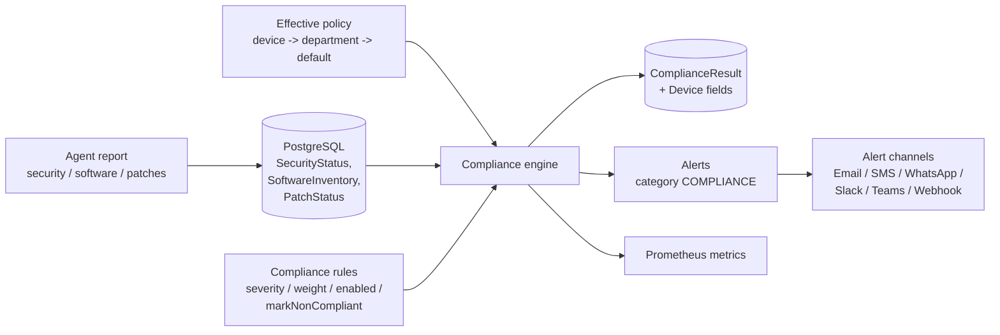
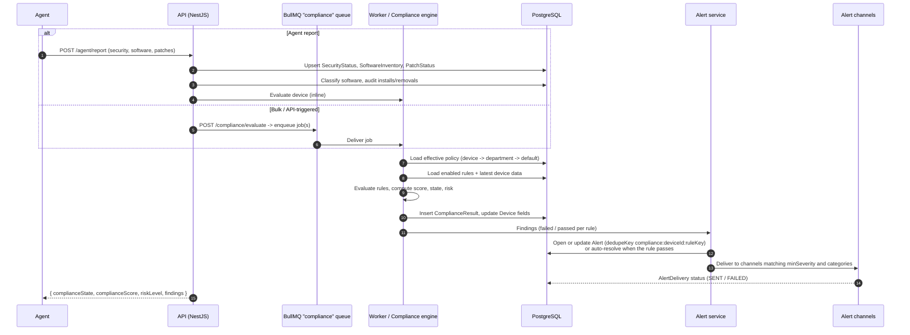
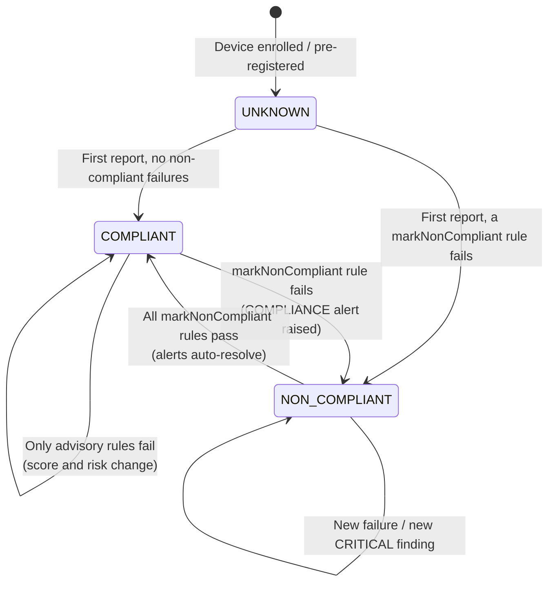
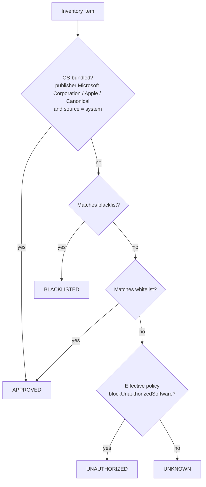
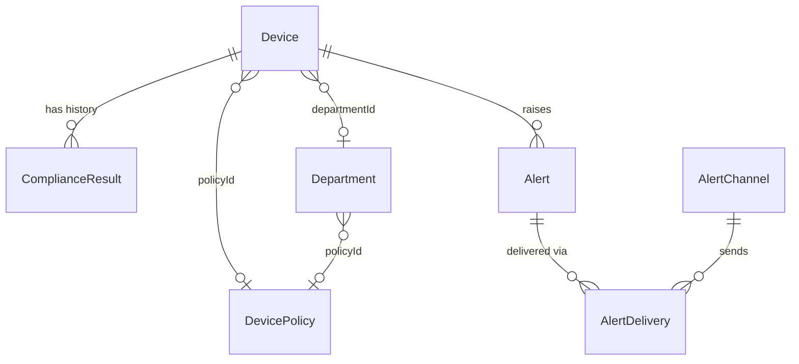

# Compliance Engine

This document explains how SecureEndpoint Manager decides whether a device is compliant: what
data the engine uses, when it runs, how built-in rules are scored, how results turn into alerts
and metrics, and how to tune the engine for your organization.

The REST contract in [API.md](API.md) is the source of truth. This page summarizes it and adds
operational guidance; if the two ever disagree, API.md wins. Related documents:
[Architecture](ARCHITECTURE.md), [Security](SECURITY.md), [Runbook](RUNBOOK.md),
[User Guide](USER-GUIDE.md).

---

## 1. Overview

For every managed device the engine:

1. Resolves the **effective policy** for the device.
2. Evaluates every **enabled compliance rule** against the device's latest security status,
   software inventory, patch status and inventory attributes.
3. Computes a **score** (0-100), a **compliance state** and a **risk level**.
4. Stores a `ComplianceResult` (with per-rule `findings`) and updates the denormalized fields on
   the `Device` (`complianceState`, `complianceScore`, `riskLevel`, `lastEvaluatedAt`).
5. Raises or auto-resolves **alerts** (category `COMPLIANCE`) and updates **Prometheus metrics**.



---

## 2. Inputs

### 2.1 Agent data

The endpoint agent sends its full state with `POST /agent/report` every `inventoryIntervalSec`
(policy default 3600 s) or when something changes. The server upserts inventory, security status
and patches, marks software that is no longer reported as removed (`removedAt`), classifies
software, audits installs/removals (audit category `SOFTWARE`), and then evaluates compliance.
The response to the agent contains the outcome:
`{ complianceState, complianceScore, riskLevel, findings }`.

| Report section | Stored in | Used by rules |
|---|---|---|
| `security.antivirusState`, `antivirusSignatureAt` | `SecurityStatus` | `ANTIVIRUS_MISSING`, `ANTIVIRUS_OUTDATED` |
| `security.edrState` | `SecurityStatus` | `EDR_MISSING` |
| `security.firewallState` | `SecurityStatus` | `FIREWALL_DISABLED` |
| `security.diskEncryptionState` | `SecurityStatus` | `DISK_ENCRYPTION_DISABLED` |
| `security.secureBootState` | `SecurityStatus` | `SECURE_BOOT_DISABLED` |
| `security.screenLockEnabled`, `screenLockTimeoutSec`, `passwordOnWake` | `SecurityStatus` | `SCREEN_LOCK_DISABLED` |
| `security.autoUpdateEnabled` | `SecurityStatus` | `AUTO_UPDATE_DISABLED` |
| `security.usbStorageEnabled` | `SecurityStatus` | `USB_STORAGE_ENABLED` |
| `software[]` | `SoftwareInventory` (classified) | `UNAUTHORIZED_SOFTWARE` |
| `patches[]` | `PatchStatus` | `CRITICAL_PATCHES_MISSING` |
| heartbeat / report timestamps | `Device.lastSeenAt` | `AGENT_OFFLINE` |
| inventory attribute | `Device.isCompanyOwned` | `NOT_COMPANY_DEVICE` |

Protection states use the `ProtectionState` enum: `ENABLED`, `DISABLED`, `NOT_INSTALLED`,
`OUTDATED`, `UNKNOWN`. Rules that require a control fail for **any value other than `ENABLED`**,
including `UNKNOWN`.

### 2.2 Effective policy

Each device is evaluated against exactly one policy, resolved in this order:

1. `device.policyId` (policy assigned directly to the device)
2. `department.policyId` (policy of the device's department)
3. the policy with `isDefault = true`

You can inspect the result with `GET /policies/effective/:deviceId`. The policy id and version
used are recorded on every `ComplianceResult` (`policyId`, `policyVersion`).

---

## 3. Evaluation triggers

| Trigger | How | Execution |
|---|---|---|
| Agent report | `POST /agent/report` | Evaluated as part of processing the report; result returned to the agent |
| Manual, single device | `POST /devices/:id/evaluate` | Runs immediately and returns the new `ComplianceResult` |
| Manual, bulk | `POST /compliance/evaluate` `{ deviceIds?: string[] }` (empty = all devices) | Jobs queued on the BullMQ `compliance` queue, processed by the worker; returns `{ queued }` |
| Policy change | `PATCH /policies/:id` | Bumps policy `version`, queues `APPLY_POLICY` for affected devices, re-evaluates compliance |
| Schedule | Periodic re-evaluation by the worker's scheduler | Catches time-based conditions (for example agent offline, signature age, patch deadlines) on devices that are not reporting |

Time-based rules (`AGENT_OFFLINE`, `ANTIVIRUS_OUTDATED`, `CRITICAL_PATCHES_MISSING`) can change
outcome without any new agent data, which is why periodic re-evaluation matters. A device that has
stopped reporting can only be flagged `AGENT_OFFLINE` by a scheduled or manual evaluation.

### 3.1 Evaluation sequence



---

## 4. Built-in rules

Rules are seeded as `ComplianceRule` rows. `severity`, `weight`, `enabled` and `markNonCompliant`
are editable (see [How to tune](#11-how-to-tune)).

| ruleKey | Condition (fails when) | Default severity | Weight | markNonCompliant |
|---|---|---|---|---|
| `USB_STORAGE_ENABLED` | `policy.usbStorageBlocked && security.usbStorageEnabled != false` | HIGH | 15 | yes |
| `DISK_ENCRYPTION_DISABLED` | `policy.requireDiskEncryption && diskEncryptionState != ENABLED` | CRITICAL | 25 | yes |
| `ANTIVIRUS_MISSING` | `policy.requireAntivirus && antivirusState != ENABLED` | CRITICAL | 25 | yes |
| `ANTIVIRUS_OUTDATED` | signatures older than `maxAvSignatureAgeDays` | MEDIUM | 5 | no |
| `EDR_MISSING` | `policy.requireEdr && edrState != ENABLED` | HIGH | 15 | yes |
| `FIREWALL_DISABLED` | `policy.requireFirewall && firewallState != ENABLED` | HIGH | 10 | yes |
| `UNAUTHORIZED_SOFTWARE` | any inventory item with status `UNAUTHORIZED` or `BLACKLISTED` | HIGH | 15 | yes |
| `SCREEN_LOCK_DISABLED` | `policy.screenLockEnabled && (!screenLockEnabled \|\| timeout > policy timeout \|\| (requirePasswordOnWake && !passwordOnWake))` | MEDIUM | 10 | yes |
| `AUTO_UPDATE_DISABLED` | `policy.autoUpdateEnabled && autoUpdateEnabled == false` | MEDIUM | 5 | no |
| `CRITICAL_PATCHES_MISSING` | `MISSING` patch with severity `CRITICAL` older than `patchDeadlineDays` | HIGH | 10 | yes |
| `SECURE_BOOT_DISABLED` | `policy.requireSecureBoot && secureBootState != ENABLED` | MEDIUM | 5 | no |
| `AGENT_OFFLINE` | `lastSeenAt` older than 7 days | LOW | 5 | no |
| `NOT_COMPANY_DEVICE` | `policy.companyDataOnlyManaged && !isCompanyOwned` | CRITICAL | 30 | yes |

Notes:

- Most rules are **gated by a policy flag**. If the policy does not require a control (for example
  `requireSecureBoot = false`, the default), the rule passes regardless of device state.
- `USB_STORAGE_ENABLED` fails when USB storage is reported enabled **or not reported at all**
  (`!= false`), so an agent that cannot determine the USB state is treated as non-enforcing.
- `AUTO_UPDATE_DISABLED` only fails on an explicit `false`; a missing value does not fail it.
- A disabled rule (`enabled = false`) is not evaluated and contributes nothing to score, state or
  risk.

### 4.1 Mapping to the core policy requirements

| # | Core requirement | Policy fields | Rules / mechanisms |
|---|---|---|---|
| 1 | Company data only on company-managed devices | `companyDataOnlyManaged` | `NOT_COMPANY_DEVICE` |
| 2 | USB storage blocked by default; whitelisting and temporary access | `usbStorageBlocked`, `allowWhitelistedUsb`, `usbReadOnly` | `USB_STORAGE_ENABLED`; USB whitelist and access requests |
| 3 | Only approved software; detect and remove unauthorized/blacklisted | `blockUnauthorizedSoftware`, `autoUninstallBlacklisted` | `UNAUTHORIZED_SOFTWARE`; software classification; `UNINSTALL_SOFTWARE` |
| 4 | Antivirus / EDR mandatory | `requireAntivirus`, `requireEdr`, `maxAvSignatureAgeDays` | `ANTIVIRUS_MISSING`, `ANTIVIRUS_OUTDATED`, `EDR_MISSING` |
| 5 | Full-disk encryption mandatory | `requireDiskEncryption` | `DISK_ENCRYPTION_DISABLED` |
| 6 | Firewall enabled | `requireFirewall` | `FIREWALL_DISABLED` |
| 7 | Automatic OS updates and critical patches within deadline | `autoUpdateEnabled`, `autoPatchDeployment`, `patchDeadlineDays`, `maintenanceWindow` | `AUTO_UPDATE_DISABLED`, `CRITICAL_PATCHES_MISSING` |
| 8 | Screen lock / password on wake | `screenLockEnabled`, `screenLockTimeoutSec`, `requirePasswordOnWake`, `screenSaverEnforced` | `SCREEN_LOCK_DISABLED` |
| 9 | Continuous monitoring, audit trail and alerting | `checkinIntervalSec`, `inventoryIntervalSec` | `AGENT_OFFLINE`; audit hash chain (`GET /audit/verify`); alerts |

`SECURE_BOOT_DISABLED` is an additional hardening rule, off by default via
`requireSecureBoot = false`.

---

## 5. Scoring

```
score = max(0, 100 − Σ weight of failed rules)
```

Only enabled rules that **failed** subtract points. Weight is independent of severity and of
`markNonCompliant`; a device can have a high score and still be `NON_COMPLIANT`, or a lower score
and still be `COMPLIANT`.

### Worked examples

**Example 1 — firewall off, stale AV signatures**

| Failed rule | Weight | markNonCompliant | Severity |
|---|---|---|---|
| `FIREWALL_DISABLED` | 10 | yes | HIGH |
| `ANTIVIRUS_OUTDATED` | 5 | no | MEDIUM |

Score = 100 − 15 = **85**. State = **NON_COMPLIANT** (firewall rule is marked non-compliant).
Risk level = **HIGH**.

**Example 2 — only advisory rules fail** (policy has `requireSecureBoot = true`)

| Failed rule | Weight | markNonCompliant | Severity |
|---|---|---|---|
| `AUTO_UPDATE_DISABLED` | 5 | no | MEDIUM |
| `SECURE_BOOT_DISABLED` | 5 | no | MEDIUM |
| `AGENT_OFFLINE` | 5 | no | LOW |

Score = 100 − 15 = **85**. State = **COMPLIANT** (no failed rule is marked non-compliant).
Risk level = **MEDIUM**. Same score as example 1, different state.

**Example 3 — personal laptop with no protection**

| Failed rule | Weight | markNonCompliant | Severity |
|---|---|---|---|
| `NOT_COMPANY_DEVICE` | 30 | yes | CRITICAL |
| `DISK_ENCRYPTION_DISABLED` | 25 | yes | CRITICAL |
| `ANTIVIRUS_MISSING` | 25 | yes | CRITICAL |
| `USB_STORAGE_ENABLED` | 15 | yes | HIGH |
| `UNAUTHORIZED_SOFTWARE` | 15 | yes | HIGH |

Sum of weights = 110, so score = max(0, 100 − 110) = **0**. State = **NON_COMPLIANT**.
Risk level = **CRITICAL**. Counters on the result: `criticalCount = 3`, `highCount = 2`.

---

## 6. States and risk levels

**Compliance state** (`ComplianceState`):

| State | Meaning |
|---|---|
| `UNKNOWN` | No security data has been received yet for the device (new or never-reporting device) |
| `NON_COMPLIANT` | At least one failed rule has `markNonCompliant = true` |
| `COMPLIANT` | Security data exists and no failed rule is marked non-compliant |

**Risk level** (`RiskLevel`) = the highest severity among failed rules, ordered
`NONE < LOW < MEDIUM < HIGH < CRITICAL`. `NONE` means no rule failed.



Device list and results can be filtered by both dimensions: `GET /devices?complianceState=&riskLevel=`
and `GET /compliance/results?state=&riskLevel=&departmentId=`.

---

## 7. Software classification

`UNAUTHORIZED_SOFTWARE` depends on how each `SoftwareInventory` item is classified. On every
report (and on `POST /software/reclassify`), each item is matched as follows:



- Blacklist takes precedence over whitelist.
- Whitelist and blacklist entries match by `name` (and optionally `publisher`) using `matchType`
  `EXACT`, `CONTAINS` (default) or `REGEX`, optionally restricted to a `platform`.
- `UNKNOWN` items do **not** fail `UNAUTHORIZED_SOFTWARE`; only `UNAUTHORIZED` and `BLACKLISTED`
  do. With `blockUnauthorizedSoftware = false`, only blacklisted software affects compliance.
- After changing the whitelist or blacklist, run `POST /software/reclassify` (returns
  `{ updated }`) and then re-evaluate affected devices.

---

## 8. Alerting

### 8.1 Compliance alerts

- On a transition to `NON_COMPLIANT`, or on a **new CRITICAL finding**, the engine raises an
  `Alert` with `category = COMPLIANCE` and the failing `ruleKey`.
- Alerts are de-duplicated with `dedupeKey = compliance:<deviceId>:<ruleKey>`, so one device and
  rule produce at most one open alert; repeat detections are folded into it (`occurrences`,
  `lastOccurredAt`) instead of creating new alerts.
- Alerts **auto-resolve** when the rule passes on a later evaluation.
- Alerts can also be handled manually: `POST /alerts/:id/acknowledge`, `POST /alerts/:id/resolve`,
  `POST /alerts/bulk`.

Alert lifecycle: `OPEN` -> `ACKNOWLEDGED` -> `RESOLVED` (acknowledgement is optional).

### 8.2 Related alerts from agent data

- **USB**: `BLOCKED` events from `POST /agent/usb-events` raise an alert with category `USB`,
  severity `MEDIUM`, de-duplicated per device + USB serial per hour.
- Software, security, patch and other categories use the same `Alert` model and channels.

### 8.3 Delivery channels

Channels are managed under `/alerts/channels` (permission `alerts:configure`). Types: `EMAIL`,
`SMS`, `WHATSAPP`, `SLACK`, `TEAMS`, `WEBHOOK`. Each channel has:

| Field | Effect |
|---|---|
| `minSeverity` | Only alerts at or above this `AlertSeverity` are delivered (default `HIGH`) |
| `categories` | The `AlertCategory` values the channel receives (e.g. `COMPLIANCE`, `USB`) |
| `enabled` | Disabled channels receive nothing |
| `config` | Write-only, stored encrypted (AES-256-GCM); returned masked |

Each delivery attempt is recorded as an `AlertDelivery` (`PENDING`, `SENT`, `FAILED`, with
`attempts` and `error`). `POST /alerts/channels/:id/test` sends a test message. Webhooks are
signed with HMAC-SHA256 in `X-SEM-Signature` when a `secret` is configured.

Because the default `minSeverity` is `HIGH`, MEDIUM alerts such as USB blocks are stored and
visible in the console but are not pushed to a channel unless you lower its `minSeverity`.

---

## 9. Data model



**`ComplianceResult`** (table `compliance_results`, one row per evaluation):

| Field | Description |
|---|---|
| `id`, `deviceId` | Identity and device |
| `policyId`, `policyVersion` | Effective policy and version used |
| `score` | 0-100 |
| `state` | `COMPLIANT` / `NON_COMPLIANT` / `UNKNOWN` |
| `riskLevel` | `NONE` .. `CRITICAL` |
| `criticalCount`, `highCount`, `mediumCount`, `lowCount` | Failed findings per severity |
| `findings` | JSON array of `ComplianceFinding` |
| `evaluatedAt` | Evaluation timestamp |

**`ComplianceFinding`** (element of `findings`):

```ts
type ComplianceFinding = {
  ruleKey: string; name: string; severity: RiskLevel; passed: boolean;
  markNonCompliant: boolean; weight: number; detail: string; remediation: string;
};
```

Findings snapshot the rule's severity, weight and `markNonCompliant` **at evaluation time**, so
historic results remain meaningful after rules are re-tuned.

**`ComplianceRule`** (table `compliance_rules`): `key`, `name`, `description`, `severity`,
`weight`, `markNonCompliant`, `enabled`, `platforms`.

Read endpoints:

| Endpoint | Returns |
|---|---|
| `GET /devices/:id/compliance` | Latest 50 `ComplianceResult` for a device |
| `GET /compliance/devices/:deviceId/history` | Compliance history for a device |
| `GET /compliance/results` | Latest results, paginated, filters `state, riskLevel, departmentId` |
| `GET /compliance/summary` | `byRule` (failing counts), `byState`, `byRisk` |
| `GET /dashboard/compliance-trend?days=30` | Daily `complianceRate` and `averageScore` |
| `GET /dashboard/top-violations?limit=5` | Most frequently failing rules |
| `GET /dashboard/department-compliance` | Compliance rate per department |

---

## 10. Metrics and monitoring

Exposed on `GET /metrics` (Prometheus, internal only):

| Metric | Type / labels | Meaning |
|---|---|---|
| `sem_devices_compliance` | gauge `{state}` | Devices per compliance state |
| `sem_devices_risk` | gauge `{risk_level}` | Devices per risk level |
| `sem_compliance_evaluations_total` | counter | Compliance evaluations performed |
| `sem_software_violations` | gauge | Software violations |
| `sem_alerts_open` | gauge `{severity}` | Open alerts |
| `sem_alerts_sent_total` | counter `{channel,status}` | Alert delivery attempts |
| `sem_queue_jobs` | gauge `{queue,state}` | BullMQ jobs, including the `compliance` queue |

Prometheus alert rules (in `deploy/prometheus/alerts.yml`) relevant to compliance:

| Alert | Fires when |
|---|---|
| `SemComplianceRateLow` | Fleet compliance rate below 80% for 30 minutes |
| `SemCriticalRiskDevices` | More than 0 devices at `CRITICAL` risk for 1 hour |
| `SemSoftwareViolationsHigh` | Software violations are high |
| `SemQueueBacklog`, `SemQueueFailedJobs` | Queue jobs (including `compliance`) are backing up or failing |
| `SemAlertDeliveryFailures` | Alert channel deliveries are failing |

The Grafana dashboard "SecureEndpoint — Compliance Overview" visualizes these series. Response
procedures are in the [Runbook](RUNBOOK.md#critical-alert).

---

## 11. How to tune

### 11.1 Rule tuning

Adjust a rule with `PATCH /compliance/rules/:id` (permission `compliance:write`: Super Admin,
Security Admin, Compliance Officer):

```json
{ "severity": "HIGH", "weight": 20, "enabled": true, "markNonCompliant": true }
```

| Field | Changes | Consider |
|---|---|---|
| `severity` | Risk level of the device and whether a new CRITICAL finding raises an alert | Drives dashboards (`criticalRisks`, `highRisks`) and which channels receive alerts |
| `weight` | Points deducted from the score | Relative importance in the score only; does not affect state |
| `enabled` | Whether the rule is evaluated at all | Prefer turning off the policy flag (e.g. `requireEdr`) for scoped exemptions instead of disabling globally |
| `markNonCompliant` | Whether a failure makes the device `NON_COMPLIANT` | Advisory rules should stay `false` to avoid alert fatigue |

Rule changes take effect on the next evaluation. To apply them immediately, run
`POST /compliance/evaluate` with an empty body (all devices) or a list of `deviceIds`.

### 11.2 Policy tuning

Policy fields change the thresholds and gates used by rules (`PATCH /policies/:id`, permission
`policies:write`). Every change bumps the policy `version`, sends `APPLY_POLICY` to affected
devices and re-evaluates them.

| Policy field | Default | Affects |
|---|---|---|
| `maxAvSignatureAgeDays` | 3 | `ANTIVIRUS_OUTDATED` |
| `patchDeadlineDays` | 14 | `CRITICAL_PATCHES_MISSING` |
| `screenLockTimeoutSec` | 300 | `SCREEN_LOCK_DISABLED` |
| `requirePasswordOnWake` | true | `SCREEN_LOCK_DISABLED` |
| `requireAntivirus`, `requireEdr`, `requireFirewall`, `requireDiskEncryption`, `requireSecureBoot` | true, true, true, true, false | Corresponding rules |
| `usbStorageBlocked` | true | `USB_STORAGE_ENABLED` |
| `blockUnauthorizedSoftware` | true | Classification of unlisted software (`UNAUTHORIZED` vs `UNKNOWN`) |
| `companyDataOnlyManaged` | true | `NOT_COMPANY_DEVICE` |
| `autoUpdateEnabled` | true | `AUTO_UPDATE_DISABLED` |

### 11.3 Department-specific policies

Rules are global, but policies are not. Create a policy for a department with different
requirements and assign it with `POST /policies/:id/assign` `{ departmentIds: [...] }` (or
`deviceIds` for individual exceptions). Resolution order is device -> department -> default, so a
device-level assignment always wins. Examples:

- Engineering build servers without EDR support: a policy with `requireEdr = false` assigned to
  those devices only.
- A lab department with a shorter patch window: `patchDeadlineDays = 7`.
- Contractors on personal hardware: keep `companyDataOnlyManaged = true` so they remain flagged
  until moved to managed devices.

### 11.4 Trade-offs and recommended baseline

- **Keep CRITICAL rules non-compliant.** `NOT_COMPANY_DEVICE`, `DISK_ENCRYPTION_DISABLED` and
  `ANTIVIRUS_MISSING` protect core requirements 1, 4 and 5; do not set `markNonCompliant = false`
  or disable them.
- Keep `USB_STORAGE_ENABLED`, `EDR_MISSING`, `FIREWALL_DISABLED`, `UNAUTHORIZED_SOFTWARE`,
  `SCREEN_LOCK_DISABLED` and `CRITICAL_PATCHES_MISSING` non-compliant as seeded.
- Leave `ANTIVIRUS_OUTDATED`, `AUTO_UPDATE_DISABLED`, `SECURE_BOOT_DISABLED` and `AGENT_OFFLINE`
  advisory (score and risk only). Promoting them increases noise.
- Tightening thresholds (e.g. `maxAvSignatureAgeDays = 1`) increases false positives on laptops
  that are offline for a weekend; loosen thresholds before lowering severities.
- Weights only change the score. If executives consume the average score, keep the sum of all
  CRITICAL weights high enough that any CRITICAL failure is visible.
- Before enabling `blockUnauthorizedSoftware` on an existing fleet, build the whitelist first;
  otherwise every unlisted application turns `UNAUTHORIZED` and most devices become non-compliant.

### 11.5 Testing a change

1. Pick a representative device and inspect its effective policy: `GET /policies/effective/:deviceId`.
2. Apply the rule or policy change.
3. Run `POST /devices/:id/evaluate` and inspect `findings`, `score`, `state` and `riskLevel`.
4. Compare with the previous result in `GET /compliance/devices/:deviceId/history`.
5. When satisfied, re-evaluate the fleet with `POST /compliance/evaluate` and watch
   `GET /compliance/summary` and `sem_devices_compliance`.

Changes are recorded in the append-only audit trail (policy changes use category
`POLICY_CHANGE`); review them with `GET /audit`.

---

## 12. FAQ

**Why is a new device `UNKNOWN`?**
No security data has been received yet. The first `POST /agent/report` produces a real state.
If it stays `UNKNOWN`, check that the device is approved (`GET /enrollment/pending`) and online.

**The score is 85 but the device is non-compliant. Is that a bug?**
No. Score and state are independent: any failure of a `markNonCompliant` rule makes the device
non-compliant regardless of score. See [worked examples](#worked-examples).

**A user fixed the issue, but the device still shows non-compliant.**
The state updates on the next evaluation. Ask the user to wait for the next report, send a
`COLLECT_INVENTORY` command (`POST /devices/:id/commands`), or run `POST /devices/:id/evaluate`.

**Why did an alert close by itself?**
Compliance alerts auto-resolve when the rule passes on a later evaluation.

**Why did I not receive an email for a USB block?**
USB block alerts are `MEDIUM`; channels default to `minSeverity = HIGH`. Lower the channel's
`minSeverity` and make sure `USB` is in its `categories`.

**Software shows as `UNKNOWN`, not `UNAUTHORIZED`.**
The effective policy has `blockUnauthorizedSoftware = false`. Only blacklisted items affect
compliance under that policy.

**Can I add custom rules?**
The API exposes the built-in rules only; you can tune them with `PATCH /compliance/rules/:id`.

**Does changing a rule rewrite history?**
No. Each `ComplianceResult` stores its findings with the rule parameters at evaluation time.

**How do I re-check everything after a large change?**
`POST /compliance/evaluate` with an empty body queues all devices on the `compliance` queue.
Monitor progress with `sem_queue_jobs{queue="compliance"}`.
