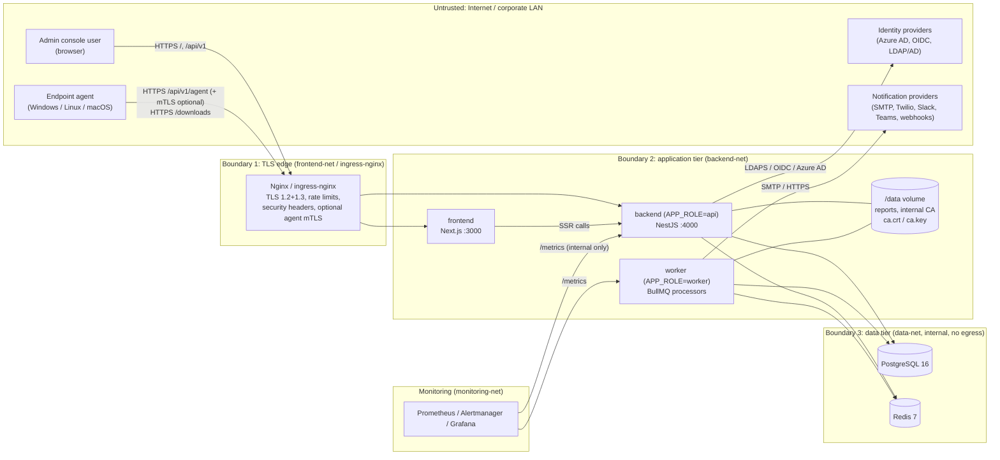

# SecureEndpoint Manager — Security Architecture and Controls

This document describes how SecureEndpoint Manager protects its own control plane and the
fleet it manages: trust boundaries, cryptography, identity and access, the agent trust
model, platform hardening, supply chain, monitoring, a STRIDE threat model, compliance
mapping hints, the vulnerability disclosure policy and an operator hardening checklist.

Related documents:

- [API contract](API.md) — source of truth for endpoints, the RBAC permission matrix and the agent protocol
- [Runbook](RUNBOOK.md) — operational procedures (secret rotation, CA rotation, incident response)
- [Architecture](ARCHITECTURE.md), [Deployment](DEPLOYMENT.md), [Environment](ENVIRONMENT.md)

Statements in this document are derived from `docs/API.md`, `backend/prisma/schema.prisma`
and the shipped infrastructure (`docker-compose.yml`, `deploy/`, `.github/workflows/`).
Where a behavior depends on backend implementation details that are not specified in
[API.md](API.md), this is called out explicitly as **implementation-defined**.

---

## Contents

1. [Architecture and trust boundaries](#architecture-and-trust-boundaries)
2. [Cryptography and data protection](#cryptography-and-data-protection)
3. [Identity and authentication](#identity-and-authentication)
4. [Authorization (RBAC)](#authorization-rbac)
5. [IP restrictions](#ip-restrictions)
6. [Audit trail](#audit-trail)
7. [Agent trust model](#agent-trust-model)
8. [Transport security (TLS)](#transport-security-tls)
9. [Rate limiting](#rate-limiting)
10. [Security headers and CSP](#security-headers-and-csp)
11. [Container and Kubernetes hardening](#container-and-kubernetes-hardening)
12. [Secrets management](#secrets-management)
13. [Supply chain security](#supply-chain-security)
14. [Logging and monitoring](#logging-and-monitoring)
15. [Threat model (STRIDE)](#threat-model-stride)
16. [Compliance mapping hints](#compliance-mapping-hints)
17. [Vulnerability disclosure policy](#vulnerability-disclosure-policy)
18. [Operator hardening checklist](#operator-hardening-checklist)

---

## Architecture and trust boundaries

SecureEndpoint Manager is single-tenant. All external traffic terminates at a reverse
proxy (Nginx in Docker Compose, ingress-nginx in Kubernetes). The data tier (PostgreSQL,
Redis) is reachable only from the backend services and never from the internet.



| Boundary | Crossing | Controls |
|---|---|---|
| Internet to edge | Browser and agent HTTPS | TLS 1.2/1.3, HSTS, per-zone rate limits, CSP, optional mTLS on `/api/v1/agent/`, `/metrics` denied from public ranges |
| Edge to application | Proxied HTTP inside `frontend-net` / cluster network | Only Nginx/ingress-nginx may reach `backend`/`frontend`; spoofable `X-SSL-Client-*` headers are blanked on non-agent locations |
| Application to data | PostgreSQL (SCRAM-SHA-256), Redis (`requirepass`) | `data-net` is `internal: true` (no egress); Kubernetes egress only from pods labelled `sem.io/db-client: "true"` |
| Application to external services | SMTP, LDAPS, HTTPS to IdPs/Twilio/Slack/Teams/webhooks | Kubernetes egress restricted to ports 443/465/587/636; cloud metadata endpoint `169.254.169.254` excluded; plain LDAP (389) not allowed |
| Endpoint to platform | Agent protocol | Enrollment token, per-device hashed agent token, device certificate from internal CA |

---

## Cryptography and data protection

### Field-level encryption (AES-256-GCM)

Sensitive columns are encrypted by the backend before they reach PostgreSQL, using
AES-256-GCM with the key in `ENCRYPTION_KEY` (base64 of 32 random bytes).

| Column | Model | Content |
|---|---|---|
| `users.mfa_secret_enc` | `User.mfaSecretEnc` | TOTP shared secret |
| `alert_channels.config_enc` | `AlertChannel.configEnc` | Channel config JSON (recipients, Slack/Teams webhook URLs, webhook HMAC secret) |
| `software_whitelist.license_key_enc` | `SoftwareWhitelist.licenseKeyEnc` | Software license keys |

- The API treats these values as **write-only**: channel `config` is returned masked and
  `licenseKey` is never returned ([API.md](API.md), Alerts and Software sections).
- GCM provides confidentiality and integrity: a modified ciphertext fails to decrypt
  rather than yielding altered plaintext.
- The ciphertext envelope format (IV/nonce and tag layout, any key identifier) is
  **implementation-defined** by the backend `CryptoService`.

**Key handling.** `ENCRYPTION_KEY` must be identical on every api and worker replica and
must survive upgrades and restores. Losing it makes the encrypted columns unreadable;
changing it without re-encrypting has the same effect. No built-in re-encryption
command is documented, so treat the key as long-lived. The safe interim process for
replacing it (MFA reset and re-entry of channel configs and license keys) is in
[RUNBOOK.md — Rotate secrets](RUNBOOK.md#rotate-secrets).

### Hashing of stored credentials

| Secret | Storage |
|---|---|
| User passwords | argon2id (`argon2` library). Cost parameters are the library defaults unless the backend overrides them (implementation-defined). |
| Refresh tokens | Hashed in `sessions.refresh_token_hash` (unique) |
| MFA recovery codes | Hashed in `users.mfa_recovery_hashes`; each code is single-use |
| Enrollment tokens (`sem_enr_...`) | Hashed in `enrollment_tokens.token_hash`; only a short `token_prefix` is kept for display. The raw token is shown once at creation. |
| Agent tokens (`sem_agt_...`) | 48 random bytes, stored as SHA-256 in `devices.agent_token_hash` |
| Device certificates | Public PEM plus SHA-256 fingerprint of the DER in `device_certificates` |

### Data at rest outside the application

The application does not encrypt whole databases or volumes. Use encrypted storage for
the PostgreSQL volume, Redis AOF/RDB, the `/data` volume (which contains the CA private
key) and all backups (disk encryption, encrypted cloud volumes, or managed database
encryption at rest).

### Webhook integrity

WEBHOOK alert channels may define a `secret`; the backend then signs each payload with
HMAC-SHA256 in the `X-SEM-Signature` header. Receivers should verify the signature with
a constant-time comparison.

---

## Identity and authentication

### Login methods

| Method | Endpoint | Notes |
|---|---|---|
| Local | `POST /auth/login` | argon2id verification, password policy, lockout |
| LDAP / Active Directory | `POST /auth/ldap/login` | Bind against `LDAP_URL`; use `ldaps://` (Kubernetes egress only allows 636). `LDAP_TLS_REJECT_UNAUTHORIZED=true` by default. Group-to-role mapping via `LDAP_GROUP_ROLE_MAP`. |
| Azure AD | `GET /auth/sso/azure-ad/login` and `/callback` | Group-to-role mapping via `AZURE_AD_GROUP_ROLE_MAP` |
| Generic OIDC | `GET /auth/sso/oidc/login` and `/callback` | |

SSO callbacks redirect to `${WEB_URL}/auth/callback` with tokens (or an `mfaToken`) in
the URL **fragment**, which browsers do not send to servers or include in `Referer`.

### Password policy and lockout

- Minimum 12 characters with upper case, lower case, digit and symbol (local accounts).
- 5 consecutive failed attempts lock the account for 15 minutes (`users.failed_login_count`,
  `users.locked_until`). Administrators can unlock early with `POST /users/:id/unlock`.
- Every attempt, successful or not, is written to `login_history` (email, provider,
  success, reason, IP, user agent, whether MFA was used) and exposed via
  `GET /audit/login-history`. The metric `sem_login_attempts_total{result}` feeds the
  `SemLoginFailureSpike` Prometheus alert.
- Passwords for LDAP/AD and SSO users are governed by the directory / identity provider.

### Tokens and sessions

| Artifact | Format | Lifetime | Revocation |
|---|---|---|---|
| Access token | JWT, HS256, signed with `JWT_ACCESS_SECRET` (at least 32 characters; `generate-secrets` uses 48 random bytes) | 15 minutes (`JWT_ACCESS_TTL=900`) | Expires naturally. Rotating `JWT_ACCESS_SECRET` invalidates all access tokens at once. |
| Refresh token | Opaque, stored hashed in `sessions` | `REFRESH_TOKEN_TTL_DAYS=7` | Rotated on every `POST /auth/refresh`; revoked by logout, `DELETE /auth/sessions/:id`, `DELETE /auth/sessions` (all other sessions) |
| MFA challenge token | `mfaToken` returned by login | 5 minutes | Only valid for `POST /auth/mfa/verify` |

- **Idle timeout:** a session whose `last_seen_at` is older than the idle window is
  revoked on its next refresh. The window is the runtime setting `sessionTimeoutMinutes`
  (`PATCH /settings`, 5–1440); `SESSION_IDLE_TIMEOUT_MINUTES=30` is only its default
  until an administrator changes it.
- **Session visibility:** users see their own sessions (IP, user agent, created, last
  seen, expiry, current) at `GET /auth/sessions`.
- **Revocation latency:** every access token carries its session id (`sid`), and each
  request checks that session through a 30-second Redis cache that is invalidated on
  revocation. Revoking a session therefore rejects its access tokens immediately, not
  after the 15-minute expiry.
- **Refresh-token reuse detection:** each session remembers the hash of the token it
  last rotated out. If that token is presented again (meaning a copy leaked), the whole
  session is revoked — attacker and legitimate client both have to sign in again — and
  an `auth.refresh.reuse_detected` audit entry (category `AUTH`, `success=false`) is
  written for investigation.
- [API.md](API.md) documents no administrator endpoint for revoking **another** user's
  sessions. Administrators contain a compromised account by deactivating it
  (`DELETE /users/:id`) and resetting MFA (`POST /users/:id/reset-mfa`); see
  [RUNBOOK.md — Suspected account compromise](RUNBOOK.md#suspected-account-compromise).

### Multi-factor authentication

- TOTP (RFC 6238, `otplib`). Enrollment: `POST /auth/mfa/setup` returns the secret,
  `otpauth://` URL and QR code; `POST /auth/mfa/enable` confirms a code and returns
  one-time **recovery codes** (stored hashed). `POST /auth/mfa/verify` accepts a TOTP or a
  recovery code.
- The TOTP secret is stored AES-256-GCM encrypted (`mfa_secret_enc`).
- **Enforcement:** roles listed in `SECURITY_MFA_REQUIRED_ROLES` (default
  `SUPER_ADMIN,SECURITY_ADMIN`) must enroll. For such users without MFA, login returns
  tokens with `user.mfaEnabled=false` and the header `X-MFA-Enrollment-Required: true`,
  and the console forces enrollment. The runtime setting `mfaRequiredRoles` can also be
  changed through `PATCH /settings`.
- `sessions.mfa_verified` records whether the session passed MFA.
- Administrators can reset a user's MFA with `POST /users/:id/reset-mfa` (audited).
- Recommendation: also require MFA at the identity provider for SSO users, and extend
  `SECURITY_MFA_REQUIRED_ROLES` to `IT_ADMIN` and `COMPLIANCE_OFFICER` in production.

---

## Authorization (RBAC)

Permissions are `resource:action` strings attached to roles. The complete role to
permission matrix is in [API.md — Roles and permissions](API.md#roles--permissions); it is
seeded and editable only by `SUPER_ADMIN` (`PATCH /roles/:id`, permission `roles:write`).

| Role | Intended use |
|---|---|
| `SUPER_ADMIN` | Full control, including roles, hard delete of devices and all settings. Keep to two or three break-glass accounts. |
| `SECURITY_ADMIN` | Security operations: policies, alert channels, settings, device commands, audit read. No user or role administration. |
| `COMPLIANCE_OFFICER` | Compliance rules, alerts triage, reports, audit read. Read-only for devices. |
| `IT_ADMIN` | Day-to-day fleet operations: devices, enrollment, software, USB, patches, users. No policy or settings writes. |
| `DEPARTMENT_MANAGER` | Read access and USB approvals for their own department(s). |
| `EMPLOYEE` | Own devices, own compliance, USB access requests. |
| `AUDITOR` | Read-only across the platform, including audit and reports. |

**Row scoping** is enforced server-side: `DEPARTMENT_MANAGER` only sees devices, users
and events of their department(s); `EMPLOYEE` only sees devices assigned to them.

Separation of duties examples built into the default matrix:

- Only `SUPER_ADMIN` holds `roles:write`; `SECURITY_ADMIN` cannot grant itself new permissions.
- `AUDITOR` holds `audit:read` but no write permission of any kind.
- `alerts:configure` (who gets notified, webhook destinations) is limited to `SUPER_ADMIN` and `SECURITY_ADMIN`.

Every change to the permission matrix is itself audited (category `USER_ACTION` or
`SYSTEM`; exact action names are implementation-defined).

---

## IP restrictions

`GET/POST/DELETE /settings/ip-restrictions` manages CIDR allow-list entries. When at least
one enabled rule exists, console API requests from other source IPs receive `403`.
Agent endpoints (`/api/v1/agent/...`) are exempt so that roaming endpoints can still check in.

- The backend sees the client IP through the proxy (`TRUST_PROXY=true`). Only enable
  `TRUST_PROXY` when the backend is reachable exclusively through Nginx / ingress-nginx,
  otherwise `X-Forwarded-For` could be forged.
- Before adding the first rule, include the network you are administering from, or you
  will lock yourself out of the console. Recovery then requires direct database access
  (`ip_restrictions.enabled=false`).

---

## Audit trail

The `audit_logs` table is **append-only** and **tamper-evident**. Each row stores
`prev_hash` (the hash of the previous row) and `hash = SHA-256(prevHash + canonical row)`,
forming a hash chain. The canonical serialization is implementation-defined.

`GET /audit/verify` walks the chain and returns
`{ valid: boolean, checked: number, brokenAt: string | null }`. `brokenAt` identifies the
first row whose hash does not match, which localizes any modification or deletion.

**What is audited** (`AuditCategory` enum and actor types `USER`, `DEVICE`, `SYSTEM`):

| Category | Examples |
|---|---|
| `AUTH` | `auth.login.success`, failed logins, MFA enable/disable/reset, logout, session revocation |
| `USER_ACTION` | User create/update/deactivate, role permission changes, unlocks |
| `DEVICE_CHANGE` | `device.update`, assignment changes, quarantine/release, retire, commands issued, enrollment approve/reject |
| `POLICY_CHANGE` | `policy.create`, policy updates and assignments, compliance rule changes |
| `USB` | Whitelist changes, access request decisions and revocations |
| `SOFTWARE` | Install/removal detected by agent reports, whitelist/blacklist edits, uninstall commands |
| `SECURITY` | Security-relevant configuration such as IP restrictions and alert channels |
| `SYSTEM` | Scheduled jobs, settings changes, maintenance |

Each row carries actor, resource, device, IP, user agent, success flag and optional
`before`/`after` snapshots. The exact set of action strings is implementation-defined;
query `GET /audit` with `category`/`action` filters to discover them.

**Limits of the hash chain.** A chain detects modification by anyone who cannot rewrite
every subsequent row. A database superuser could recompute the entire chain. Mitigations:

1. Export regularly (`GET /audit/export?format=csv`) to write-once storage (object lock / WORM).
2. Record the output of `GET /audit/verify` and the latest row hash in an external system on a schedule.
3. Restrict and monitor direct database access; the application role should be the only writer.

---

## Agent trust model

| Credential | Issued | Stored server-side | Used for |
|---|---|---|---|
| Enrollment token `sem_enr_...` | `POST /enrollment/tokens` (permission `enrollment:manage`) with optional `platform`, `departmentId`, `policyId`, `maxUses` (default 100), `expiresInDays`, `autoApprove` | SHA-256 hash + prefix, `used_count`, `expires_at`, `revoked_at` | One call: `POST /agent/enroll` |
| Agent token `sem_agt_...` | At enrollment | SHA-256 hash in `devices.agent_token_hash` | Every agent call: `Authorization: Bearer` plus `X-Device-Id` |
| Device certificate | At enrollment, signed by the internal CA from the agent's RSA-2048 CSR (1-year validity); renewed automatically with a fresh key 30 days before expiry via `POST /agent/certificate/renew`, which revokes the previous certificate | `device_certificates` (PEM, serial, SHA-256 fingerprint, `expires_at`, `revoked_at`) | Optional mTLS at the proxy |
| Internal CA | Backend, key at `/data/pki/ca.key`, certificate at `/data/pki/ca.crt` | Shared `/data` volume | Signing device certificates; public cert at `GET /enrollment/ca.pem` |

Properties:

- **Enrollment gating:** tokens expire, have a use limit and can be revoked
  (`DELETE /enrollment/tokens/:id`). With `autoApprove=false`, new devices stay `PENDING`
  until approved (`POST /enrollment/devices/:id/approve`) or rejected.
- **Per-device secret:** the agent token is unique per device; a stolen token only
  impersonates that device, and only together with its `X-Device-Id`.
- **Revocation on retire:** `DELETE /devices/:id` sets `status=RETIRED` and revokes the
  agent token and certificates.
- **Rotation on re-enrollment:** re-enrolling a device with an existing `serialNumber`
  rotates both the agent token and the certificate (no duplicate device row).
- **Quarantine:** `POST /devices/:id/quarantine` sets `QUARANTINED`. The exact effect on
  agent behavior is implementation-defined; see the runbook for usage.
- **Endpoint-side storage** of the agent token and private key (file permissions,
  OS keystore use) is defined by the agent implementation; it should be readable only by
  SYSTEM/root.

**mTLS at the proxy (optional).** Nginx (`deploy/nginx/conf.d/secureendpoint.conf`,
commented block) or ingress-nginx (`auth-tls-*` annotations on Ingress `sem-agent`) can
require the device certificate on `/api/v1/agent/`. `optional` verification keeps
`/api/v1/agent/enroll` and the console usable without a client certificate. Nginx forwards
`X-SSL-Client-Verify`, `X-SSL-Client-Fingerprint` (SHA-1, as provided by Nginx) and
`X-SSL-Client-Serial`; ingress-nginx forwards `ssl-client-verify` and `ssl-client-cert`.
These headers are blanked on all other locations so clients cannot inject them.

Whether the backend binds the presented certificate to the device (for example by
matching the serial against `device_certificates`) is implementation-defined. The proxy
checks only that the certificate chains to the CA; it does not consult
`device_certificates.revoked_at`. Revocation is therefore enforced by the agent token,
which retire invalidates.

```mermaid
sequenceDiagram
  autonumber
  actor Admin
  participant API as Backend API
  participant CA as Internal CA (/data/pki)
  participant Proxy as Nginx / ingress-nginx
  participant Agent as Endpoint agent

  Admin->>API: POST /enrollment/tokens {maxUses, expiresInDays, autoApprove}
  API-->>Admin: sem_enr_... (shown once; stored hashed)
  Admin->>API: GET /enrollment/install-command?tokenId=&platform=
  API-->>Admin: one-liner + downloadUrl (/downloads/)
  Note over Agent: Install script verifies checksums.txt,<br/>fetches /api/v1/enrollment/ca.pem
  Agent->>Agent: Generate RSA-2048 key pair and CSR
  Agent->>Proxy: POST /api/v1/agent/enroll (TLS, no client cert)
  Proxy->>API: forward (sem_enroll rate limit)
  API->>API: Verify token hash, expiry, maxUses, not revoked
  API->>CA: Sign CSR
  CA-->>API: Device certificate
  API-->>Agent: deviceId, sem_agt_... (stored as SHA-256), certificatePem, caCertificatePem, policy, status ACTIVE or PENDING
  loop Every checkinIntervalSec
    Agent->>Proxy: POST /api/v1/agent/heartbeat (Bearer agentToken, X-Device-Id, client cert if mTLS)
    Proxy->>Proxy: Verify client cert chains to CA (if enforced)
    Proxy->>API: forward + X-SSL-Client-Verify / Fingerprint / Serial
    API->>API: SHA-256(agentToken) == devices.agent_token_hash
    API-->>Agent: policy, policyVersion, pending commands
  end
  Admin->>API: DELETE /devices/:id (retire)
  API->>API: status RETIRED, clear token hash, set certificate revokedAt
  Agent->>Proxy: POST /api/v1/agent/heartbeat
  Proxy->>API: forward
  API-->>Agent: 401 Unauthorized
```

Certificate validity periods, CA generation on first start and CA key algorithm are
implementation-defined. CA rotation procedures are in
[RUNBOOK.md — Internal CA rotation](RUNBOOK.md#internal-ca-rotation).

**Agent distribution.** Binaries and install scripts are served from `/downloads/`
(populated by the `agent-dist` image) together with `checksums.txt`. Release artifacts are
signed with `cosign sign-blob` and published with Sigstore bundles by the release
workflow (see [Supply chain security](#supply-chain-security)).

---

## Transport security (TLS)

| Setting | Value (Nginx `secureendpoint.conf`) |
|---|---|
| Protocols | TLS 1.2 and TLS 1.3 (Mozilla "intermediate") |
| Ciphers (TLS 1.2) | ECDHE with AES-GCM or CHACHA20-POLY1305 only |
| Curves | X25519, prime256v1, secp384r1 |
| Session tickets | Disabled; shared session cache 20 MB, 1 day |
| HTTP | Port 80 only serves ACME challenges and a loopback health check; everything else redirects to HTTPS |
| HSTS | `max-age=63072000; includeSubDomains` (Nginx snippet; ingress-nginx via controller ConfigMap) |
| OCSP stapling | Present but commented out; enable with a publicly trusted certificate |

In Kubernetes, TLS is terminated by ingress-nginx with a cert-manager certificate
(`sem-tls`, issuer `letsencrypt-prod`), `force-ssl-redirect` on every Ingress, and
`/metrics` is never routed.

Internal hops (proxy to backend, backend to PostgreSQL/Redis inside `data-net`) are
plaintext on isolated networks. For managed databases outside the cluster use
`sslmode=require` (or `verify-full`) in `DATABASE_URL` and `rediss://` in `REDIS_URL`, as
shown in `deploy/k8s/base/secret.example.yaml`.

---

## Rate limiting

**Application (NestJS throttler):** `RATE_LIMIT_MAX=300` requests per `RATE_LIMIT_TTL=60`
seconds per client, and `AUTH_RATE_LIMIT_MAX=10` per window for authentication endpoints.
Exceeding a limit returns `429`. Counters are stored in Redis (`sem:throttle:*`, updated
atomically by a Lua script), so limits hold across all API replicas instead of multiplying
with the replica count. If Redis is unreachable the application limiter fails open and the
Nginx / ingress limits below remain the enforcing layer.

**Nginx zones** (`deploy/nginx/nginx.conf`):

| Zone | Key | Rate | Applied to |
|---|---|---|---|
| `sem_general` | client IP | 30 r/s, burst 100 (50 for downloads) | `/` console, `/downloads/` |
| `sem_api` | client IP | 20 r/s, burst 60 | `/api/` |
| `sem_auth` | client IP | 10 r/min, burst 10 | `/api/v1/auth/` |
| `sem_agent` | `X-Device-Id` | 2 r/s, burst 30 | `/api/v1/agent/` |
| `sem_enroll` | client IP | 30 r/min, burst 20 | `/api/v1/agent/enroll` |
| `sem_conn` | client IP | 100 concurrent connections | whole HTTPS server |

**ingress-nginx:** `sem-web` 20 r/s (burst x5, 50 connections), `sem-auth` 20 r/min,
`sem-agent` 100 r/s per IP (agents often share NAT egress), `sem-downloads` 20 r/s.

---

## Security headers and CSP

Applied to every content-serving location (`deploy/nginx/snippets/security-headers.conf`;
Kubernetes uses the `sem-security-headers` ConfigMap through `custom-headers`):

| Header | Value |
|---|---|
| `Strict-Transport-Security` | `max-age=63072000; includeSubDomains` |
| `X-Frame-Options` | `DENY` |
| `X-Content-Type-Options` | `nosniff` |
| `Referrer-Policy` | `strict-origin-when-cross-origin` |
| `Permissions-Policy` | camera, microphone, geolocation, payment, usb, interest-cohort disabled |
| `Cross-Origin-Opener-Policy` / `Cross-Origin-Resource-Policy` | `same-origin` |
| `Content-Security-Policy` | `default-src 'self'`; `script-src 'self' 'unsafe-inline'`; `style-src 'self' 'unsafe-inline'`; `connect-src 'self'`; `frame-ancestors 'none'`; `object-src 'none'`; `base-uri 'self'`; `form-action 'self'`; `upgrade-insecure-requests` |
| `Cache-Control` | `no-store` on all API responses |
| `X-Request-Id` | Correlates proxy and backend logs |

The backend additionally sets `helmet` headers. `'unsafe-inline'` for scripts is required
by the Next.js App Router bootstrap unless nonces are wired through middleware; this is a
known residual risk mitigated by `connect-src 'self'`, `frame-ancestors 'none'` and the
absence of third-party script origins.

---

## Container and Kubernetes hardening

**Docker Compose** (`docker-compose.yml`):

- `read_only: true` root filesystem on every long-running service, with `tmpfs` only where needed.
- `security_opt: no-new-privileges:true` on all services.
- CPU and memory limits on every service; `json-file` log rotation (10 MB x 5).
- `data-net` is an `internal` network: PostgreSQL and Redis have no route to the internet
  and publish no ports. `agent-dist` runs with `network_mode: none`.
- PostgreSQL initialized with `--auth-host=scram-sha-256 --data-checksums`; Redis requires a
  password and uses `noeviction` so queued jobs are never silently dropped.
- Monitoring UIs bind to `MONITORING_BIND` (default `127.0.0.1`). Grafana runs with
  `GF_SECURITY_COOKIE_SECURE=false` because it is local-only; put it behind TLS before
  exposing it.

**Kubernetes** (`deploy/k8s/base`):

- Namespace `secureendpoint` enforces Pod Security Admission `restricted` (enforce, warn, audit).
- Pods: `runAsNonRoot: true`, `runAsUser: 1000`, `seccompProfile: RuntimeDefault`,
  `automountServiceAccountToken: false`. Containers: `readOnlyRootFilesystem: true`,
  `allowPrivilegeEscalation: false`, `capabilities.drop: ["ALL"]`.
- **NetworkPolicies:** `default-deny-all` (ingress and egress), then explicit allows: DNS
  to kube-dns; ingress-nginx to `sem-api`/`sem-frontend`/`sem-downloads`; `sem-frontend` to
  `sem-api:4000`; Prometheus (namespace `monitoring`) to `/metrics` on api and worker; and
  `backend-egress` for pods labelled `sem.io/db-client: "true"` (PostgreSQL 5432, Redis
  6379/6380, and 443/465/587/636 excluding `169.254.169.254`). Narrow the `0.0.0.0/0`
  ipBlocks to your managed database CIDRs and egress proxy where possible.
- Migrations run in the one-shot Job `sem-migrate`; the long-running api does not need
  schema-changing privileges at runtime if you use a separate database role for the Job.

---

## Secrets management

| Secret | Purpose | Rotation impact |
|---|---|---|
| `ENCRYPTION_KEY` | AES-256-GCM field encryption | **Crown jewel.** Loss or change makes MFA secrets, channel configs and license keys unreadable. |
| `/data/pki/ca.key` | Internal device CA private key | **Crown jewel.** Compromise allows minting device certificates that pass proxy mTLS. |
| `JWT_ACCESS_SECRET` | Signs access tokens | Rotation logs out access tokens only; refresh tokens continue to work |
| `POSTGRES_PASSWORD` / `DATABASE_URL` | Database access | Requires coordinated DB and app update |
| `REDIS_PASSWORD` / `REDIS_URL` | Queue and cache access | Requires coordinated Redis and app restart |
| `SMTP_PASSWORD`, `TWILIO_AUTH_TOKEN`, `LDAP_BIND_PASSWORD`, `AZURE_AD_CLIENT_SECRET`, `OIDC_CLIENT_SECRET` | Integrations | Rotate at provider, update, restart |
| `SEED_ADMIN_PASSWORD`, `GRAFANA_ADMIN_PASSWORD` | Initial credentials | Change after first login |

- **Docker Compose:** `make secrets` (`scripts/generate-secrets.sh` / `.ps1`) creates `.env`
  from `.env.example` with fresh random values (`openssl rand`), `umask 077` and mode
  `600`. It refuses to overwrite an existing `.env`; `--force` rotates **every** secret,
  including `ENCRYPTION_KEY`, and must never be used on a live system.
- **Kubernetes:** the Secret `sem-secrets` is created out of band and is not referenced by
  `kustomization.yaml`. Prefer External Secrets Operator (`deploy/k8s/examples/external-secret.yaml`,
  backed by AWS Secrets Manager, Azure Key Vault, GCP Secret Manager or Vault) or Sealed
  Secrets (commit only the `SealedSecret`). Enable etcd encryption at rest.
- Store an offline copy of `ENCRYPTION_KEY` and a backup of `/data/pki` in a vault with
  restricted access. Back them up **separately** from database dumps so that a leaked
  dump alone does not expose encrypted fields.
- Procedures: [RUNBOOK.md — Rotate secrets](RUNBOOK.md#rotate-secrets).

---

## Supply chain security

| Control | Where |
|---|---|
| SBOM | `release.yml`: image builds with `sbom: true` |
| SLSA provenance | `release.yml`: `provenance: mode=max` and `actions/attest-build-provenance` |
| Image signing | cosign keyless (Sigstore / Fulcio, GitHub OIDC) on the image digest |
| Artifact signing | `cosign sign-blob --bundle` for agent binaries and scripts |
| Signature verification at deploy | `deploy.yml` runs `cosign verify` with identity `.../.github/workflows/release.yml@refs/tags/v*` and issuer `https://token.actions.githubusercontent.com` |
| Vulnerability gate | Trivy image scan blocks releases with CRITICAL findings; Trivy filesystem scan uploads SARIF in CI |
| SAST | CodeQL (`codeql.yml`) |
| Dependency updates | Dependabot (`.github/dependabot.yml`) |
| Dependency audit | `npm audit --audit-level=high --omit=dev` (backend, frontend; non-blocking) and `govulncheck ./...` (agent) in CI |
| Ownership | `CODEOWNERS` and pull request template |

Operators pulling images manually should verify them the same way:

```bash
cosign verify ghcr.io/secureendpoint/secureendpoint-manager/backend:vX.Y.Z \
  --certificate-identity-regexp '^https://github.com/<org>/<repo>/\.github/workflows/release\.yml@refs/tags/v' \
  --certificate-oidc-issuer https://token.actions.githubusercontent.com
```

Deploy by digest rather than mutable tags in production.

---

## Logging and monitoring

- **Application audit:** `audit_logs` (hash chain) and `login_history`, exported via
  `GET /audit/export` and reportable as `AUDIT` reports.
- **Access logs:** Nginx writes JSON access logs (`sem_json` format) to stdout, including a
  request ID. Container logs are rotated by Docker (`json-file`, 10 MB x 5).
- **Metrics:** `GET /metrics` on api and worker, reachable only from internal ranges
  (Nginx) or the `monitoring` namespace (Kubernetes). Security-relevant series:
  `sem_login_attempts_total{result}`, `sem_usb_blocked_total`, `sem_software_violations`,
  `sem_devices_risk{risk_level}`, `sem_devices_compliance{state}`,
  `sem_alerts_open{severity}`, `sem_alerts_sent_total{channel,status}`,
  `sem_agent_checkins_total`.
- **Prometheus alerts** (`deploy/prometheus/alerts.yml`): security-relevant rules include
  `SemLoginFailureSpike`, `SemCriticalRiskDevices`, `SemUsbBlockSpike`,
  `SemSoftwareViolationsHigh`, `SemAgentCheckinsStalled`, `SemOnlineDevicesDrop` and
  `SemAlertDeliveryFailures`; availability rules include `SemApiDown`, `SemWorkerDown`,
  `SemPostgresDown`, `SemRedisDown`, `SemHighErrorRate`.
- **Application alerts** (`Alert` model) cover categories COMPLIANCE, USB, SOFTWARE,
  SECURITY, PATCH, AUTH, DEVICE and SYSTEM and are delivered through email, SMS, WhatsApp,
  Slack, Teams and signed webhooks. Forward them, and the audit export, to your SIEM.
- Dashboards: "SecureEndpoint — Compliance Overview" and "SecureEndpoint — Platform Health".

---

## Threat model (STRIDE)

| # | STRIDE | Threat | Component | Mitigation | Residual risk |
|---|---|---|---|---|---|
| 1 | Spoofing | Credential stuffing / brute force against console login | `/api/v1/auth/*` | argon2id, password policy, 5-attempt lockout, `sem_auth` 10 r/min, app auth throttle, MFA, `SemLoginFailureSpike` | Lockout can be abused to deny service to known accounts (low) |
| 2 | Spoofing | Stolen access or refresh token replayed | Sessions | 15-min access TTL, refresh rotation, idle timeout, session revocation, IP restrictions | Access token valid until expiry unless `JWT_ACCESS_SECRET` rotated (low) |
| 3 | Spoofing | Rogue device enrolls with leaked enrollment token | `/agent/enroll` | Hashed tokens with expiry, `maxUses`, revocation, `autoApprove=false` for broad tokens, `sem_enroll` rate limit | Leaked token usable until revoked/expired (medium, reduce with short expiry) |
| 4 | Spoofing | Agent impersonation with stolen agent token | Agent protocol | Per-device token bound to `X-Device-Id`, optional mTLS, retire revokes | Token theft from a compromised endpoint (medium; endpoint compromise is out of scope) |
| 5 | Tampering | Modification or deletion of audit records | `audit_logs` | SHA-256 hash chain, `GET /audit/verify`, export to WORM storage | DB superuser can recompute the chain without external anchoring (medium) |
| 6 | Tampering | Agent reports falsified security posture | `/agent/report` | Authenticated agent, server-side evaluation, audit of changes | Compromised endpoint can lie about local state (medium; inherent to agent-based posture) |
| 7 | Tampering | Malicious or tampered image / agent binary | Supply chain | Cosign keyless signatures, provenance, SBOM, Trivy gate, `checksums.txt` | Compromise of the source repository or CI identity (low) |
| 8 | Repudiation | Administrator denies a destructive action | All write APIs | Actor, IP, user agent and before/after captured in audit log; login history | Shared accounts defeat attribution; prohibit them (low) |
| 9 | Information disclosure | Database dump leaks secrets | PostgreSQL, backups | AES-256-GCM for MFA secrets, channel configs, license keys; hashed passwords and tokens; `ENCRYPTION_KEY` stored separately | Non-encrypted PII (names, emails, inventory) exposed; encrypt backups (medium) |
| 10 | Information disclosure | `/metrics` or Swagger exposes internals | Backend | `/metrics` internal only; `/api/docs` is public by default | API schema discoverable; restrict `/api/docs` at the proxy if required (low) |
| 11 | Information disclosure | Cross-department data access | RBAC | Server-side row scoping, least-privilege roles | Misconfigured custom role permissions (low) |
| 12 | Denial of service | Request floods | Edge and API | Nginx zones, connection limits, app throttler, resource limits, HPA | Volumetric attacks need upstream DDoS protection (medium) |
| 13 | Denial of service | Queue exhaustion / Redis memory full | Worker, Redis | `noeviction`, `SemQueueBacklog`, `SemQueueFailedJobs`, `SemRedisDown` | Enqueue fails when Redis is full (low) |
| 14 | Elevation of privilege | User grants themselves more permissions | Roles | Only `SUPER_ADMIN` holds `roles:write`; changes audited; MFA enforced | Compromised SUPER_ADMIN (high impact; keep few, MFA, IP restrictions) |
| 15 | Elevation of privilege | Container escape / lateral movement | Runtime | Non-root, read-only FS, drop ALL caps, no-new-privileges, seccomp, PSA restricted, default-deny NetworkPolicies | Kernel or runtime zero-days (low) |
| 16 | Elevation of privilege | Internal CA key theft | `/data/pki/ca.key` | Volume access limited to api/worker, backups encrypted, emergency CA rotation | Attacker can pass proxy mTLS; agent token still required (medium) |
| 17 | Spoofing | Forged `X-Forwarded-For` or `X-SSL-Client-*` headers | Proxy to backend | Headers set/blanked by Nginx; backend reachable only through proxy | Direct exposure of port 4000 would bypass this (low if networks unchanged) |

---

## Compliance mapping hints

> **Hints, not certification.** The table below shows where SecureEndpoint Manager can
> provide evidence or supporting controls. Certification depends on your organization's
> scope, processes and auditor judgment.

| Framework | Control | How the platform helps |
|---|---|---|
| ISO/IEC 27001:2022 | A.5.15 Access control | RBAC roles and permission matrix, row scoping, IP restrictions |
| ISO/IEC 27001:2022 | A.8.1 User endpoint devices | Device inventory, assignments, enrollment, policies, compliance engine (requirements 1-9) |
| ISO/IEC 27001:2022 | A.8.2 Privileged access rights | Limited `SUPER_ADMIN`/`SECURITY_ADMIN`, enforced MFA, audit of role changes |
| ISO/IEC 27001:2022 | A.8.3 Information access restriction | Server-side row scoping, write-only secrets |
| ISO/IEC 27001:2022 | A.8.5 Secure authentication | argon2id, password policy, lockout, TOTP MFA, SSO/LDAP, short-lived JWTs |
| ISO/IEC 27001:2022 | A.8.7 Protection against malware | `ANTIVIRUS_MISSING`, `ANTIVIRUS_OUTDATED`, `EDR_MISSING` rules; blacklist and auto-uninstall |
| ISO/IEC 27001:2022 | A.8.8 Management of technical vulnerabilities | Patch status, CVE/vulnerability report, `CRITICAL_PATCHES_MISSING`, patch deployment |
| ISO/IEC 27001:2022 | A.8.9 Configuration management | Versioned device policies, firewall/encryption/screen-lock/secure-boot rules, IaC deployment |
| ISO/IEC 27001:2022 | A.8.12 Data leakage prevention | USB storage blocking, whitelisting, time-bound access requests, `NOT_COMPANY_DEVICE` |
| ISO/IEC 27001:2022 | A.8.15 Logging | Hash-chained audit log, login history, export |
| ISO/IEC 27001:2022 | A.8.16 Monitoring activities | Alerts and channels, Prometheus rules, dashboards, `AGENT_OFFLINE` |
| ISO/IEC 27001:2022 | A.8.19 Installation of software on operational systems | Software whitelist/blacklist, `UNAUTHORIZED_SOFTWARE`, uninstall commands |
| ISO/IEC 27001:2022 | A.8.24 Use of cryptography | Disk-encryption rule; AES-256-GCM field encryption; TLS 1.2+; internal device CA |
| SOC 2 | CC6.1 Logical access | RBAC, MFA, IP restrictions, encryption of sensitive fields |
| SOC 2 | CC6.2 / CC6.3 Provisioning and removal | User lifecycle APIs, LDAP/SSO group mapping, deactivation, device retire |
| SOC 2 | CC6.6 / CC6.7 Boundary and transmission protection | TLS edge, NetworkPolicies, USB and data-on-managed-device controls |
| SOC 2 | CC6.8 Unauthorized software | Software allow/deny lists, malware protection rules |
| SOC 2 | CC7.1 Configuration and vulnerability detection | Compliance engine, patch and vulnerability reports |
| SOC 2 | CC7.2 / CC7.3 Monitoring and event evaluation | Alerts, audit trail, Prometheus rules |
| SOC 2 | CC7.4 / CC7.5 Incident response and recovery | Quarantine, remote commands, [RUNBOOK](RUNBOOK.md) procedures, backups |
| CIS Controls v8 | 1 Inventory of enterprise assets | Device inventory, hardware data, warranty, assignments |
| CIS Controls v8 | 2 Inventory of software assets | Software inventory, licenses, allow/deny lists |
| CIS Controls v8 | 3 Data protection | Disk encryption, USB control, company-data-on-managed-devices |
| CIS Controls v8 | 4 Secure configuration | Policies for firewall, screen lock, secure boot, auto-update |
| CIS Controls v8 | 7 Continuous vulnerability management | Patch status, CVE report, deadlines, deployment |
| CIS Controls v8 | 10 Malware defenses | AV/EDR presence and signature age rules |

---

## Vulnerability disclosure policy

We welcome reports from security researchers and customers.

- **Contact:** `security@<your-domain>` (placeholder; replace with the maintainer's
  security address before publishing). Encrypt sensitive details if a PGP key is published.
- **Include:** affected version or commit, component, reproduction steps, impact, and any
  proof-of-concept. Do not include real customer data.
- **Response targets:** acknowledgement within 3 business days, initial assessment within
  10 business days, regular status updates until resolution.
- **Coordinated disclosure:** we ask for **90 days** from acknowledgement before public
  disclosure, or less if a fix ships earlier. We will agree on a date with you and credit
  you in the advisory unless you prefer anonymity.
- **In scope:** backend API, admin console, endpoint agent and install scripts, container
  images, Helm/Kustomize/Compose configuration shipped in this repository, release
  signing and CI workflows.
- **Out of scope:** findings requiring physical access or an already-compromised endpoint
  administrator account; volumetric denial of service; social engineering; third-party
  services (identity providers, Twilio, Slack); missing best-practice headers without a
  demonstrated impact; issues in deployments that deviate from the documented hardening.
- **Safe harbor:** we will not pursue legal action for good-faith research that respects
  this policy, avoids privacy violations and service degradation, uses only test accounts
  and systems you own or are authorized to test, and stops at the minimum access needed to
  demonstrate the issue.

---

## Operator hardening checklist

Before go-live:

- [ ] `.env` / `sem-secrets` generated with `make secrets` or equivalent; no `CHANGE_ME` values remain.
- [ ] `ENCRYPTION_KEY` and a backup of `/data/pki` stored offline in a vault, separately from database backups.
- [ ] `SEED_DEMO_DATA=false`; strong `SEED_ADMIN_PASSWORD`; seeded admin password changed after first login.
- [ ] Publicly trusted TLS certificate installed; OCSP stapling enabled; HTTPS-only confirmed.
- [ ] `SECURITY_MFA_REQUIRED_ROLES` covers every administrative role; all admins enrolled in MFA.
- [ ] No more than three `SUPER_ADMIN` accounts; break-glass account documented.
- [ ] IP restrictions configured for console access (including your own admin network).
- [ ] LDAP uses `ldaps://` with `LDAP_TLS_REJECT_UNAUTHORIZED=true`; SSO redirect URIs match `WEB_URL`.
- [ ] `CORS_ORIGINS`, `WEB_URL`, `API_PUBLIC_URL` set to the real domain; `TRUST_PROXY=true` only behind the proxy.
- [ ] Agent mTLS enabled at Nginx or ingress-nginx after the fleet has enrolled.
- [ ] Enrollment tokens scoped (platform/department/policy), short `expiresInDays`, sensible `maxUses`; `autoApprove=false` for broad tokens.
- [ ] Monitoring profile or Prometheus Operator deployed; Alertmanager routes for critical alerts tested.
- [ ] At least one alert channel per severity tested with `POST /alerts/channels/:id/test`; webhook `secret` set.
- [ ] Backups scheduled for PostgreSQL and `/data`, encrypted and restore-tested ([RUNBOOK](RUNBOOK.md#backup--restore)).
- [ ] Audit export shipped to WORM storage or SIEM; `GET /audit/verify` checked on a schedule.
- [ ] Images deployed by digest and verified with `cosign verify`.
- [ ] Kubernetes: PSA `restricted` enforced, NetworkPolicies applied and ipBlocks narrowed, etcd encryption on, External Secrets or Sealed Secrets in use.
- [ ] Monitoring UIs not exposed publicly (`MONITORING_BIND=127.0.0.1` or authenticated ingress).
- [ ] Consider restricting `/api/docs` to internal networks at the proxy.

Ongoing:

- [ ] Review `GET /audit/login-history` failures and `SemLoginFailureSpike` alerts weekly.
- [ ] Review users and role assignments quarterly; deactivate leavers promptly.
- [ ] Revoke unused enrollment tokens; review `PENDING` devices.
- [ ] Apply Dependabot and image updates; re-run Trivy on deployed digests.
- [ ] Track TLS certificate and device certificate expiry ([RUNBOOK](RUNBOOK.md#certificate-tls-expiry)).
- [ ] Rotate integration secrets per policy ([RUNBOOK](RUNBOOK.md#rotate-secrets)).
